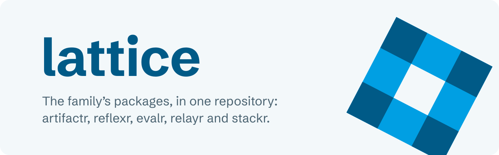
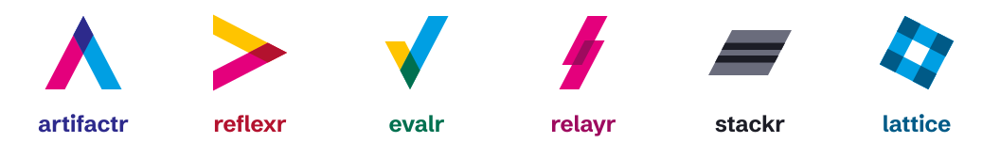

<picture>
  <source media="(prefers-color-scheme: dark)" srcset="docs/assets/brand/banner-dark.svg">
  
</picture>

<p>
  <a href="https://github.com/alexnodeland/lattice/actions/workflows/nightly.yml"></a>
  <a href="https://lattice.alexnodeland.com"></a>
  
  
  
  <a href="LICENSE"></a>
</p>

**lattice** is the family's packages, in one repository: Python libraries for applications in which people and agents work together, and the stack they run on. Each package keeps its own name, version, dependencies, extras, changelog and releases; they share one environment, one lockfile, one CI, one documentation site and one set of quality gates, so a change that spans packages lands in one pull request and the packages never disagree on `main`.

## The family

<picture>
  <source media="(prefers-color-scheme: dark)" srcset="docs/assets/brand/family-dark.svg">
  
</picture>

| Package | What it is | Docs | Distribution |
|---|---|---|---|
| [artifactr](packages/artifactr) | Chat applications where people and agents collaborate through shared, versioned artifacts | [artifactr](https://lattice.alexnodeland.com/artifactr/) | `artifactr-ai` |
| [reflexr](packages/reflexr) | Rules over event streams that run LLM workflows: pydantic-ai agents, pydantic-graph graphs and functions | [reflexr](https://lattice.alexnodeland.com/reflexr/) | `reflexr` |
| [evalr](packages/evalr) | Typed evaluation of agent systems: judges that give typed verdicts, trained on people's feedback and measured against it | [evalr](https://lattice.alexnodeland.com/evalr/) | `evalr` |
| [relayr](packages/relayr) | The bridge between artifactr and reflexr: events from chats and artifacts become events for rules, and runs act back in the chat | [relayr](https://lattice.alexnodeland.com/relayr/adr/) | `relayr-ai` |
| [stackr](packages/stackr) | The infrastructure the libraries run on (local Supabase, the LiteLLM gateway, OpenTelemetry, Grafana and Langfuse), and an application template | [stackr](https://lattice.alexnodeland.com/stackr/) | none: it ships no wheel |

Two more are planned. **grantr** is identity and access for artifactr and reflexr: users, groups, roles and permissions, bound to tenants and workspaces and checked by their authorize hooks. **portalr** is the portal into the system: chat with your agents, see artifacts, rules and runs, and manage access, traces, feedback, evals and analytics.

> **Status:** alpha. artifactr's [0.1.0](https://github.com/alexnodeland/artifactr/releases/tag/v0.1.0) is the family's first release; the other packages haven't had one. APIs may still change before 1.0.

## Installing a package

Python 3.12 or newer. Until the packages are on PyPI, install one from its subdirectory of this repository with [uv](https://docs.astral.sh/uv/). A release is tagged with its package's name, as in `artifactr-v0.1.0`; a package without a release installs from `main`:

```bash
uv add "artifactr-ai @ git+https://github.com/alexnodeland/lattice@artifactr-v0.1.0#subdirectory=packages/artifactr"
uv add "reflexr @ git+https://github.com/alexnodeland/lattice#subdirectory=packages/reflexr"
uv add "evalr @ git+https://github.com/alexnodeland/lattice#subdirectory=packages/evalr"
uv add "relayr-ai @ git+https://github.com/alexnodeland/lattice#subdirectory=packages/relayr"
```

uv takes relayr's own dependencies, artifactr and reflexr, from the same commit. Each package's getting-started page lists its extras, such as artifactr's `fastapi`, `mcp` and `postgres`.

## Starting an application

stackr's [Copier](https://copier.readthedocs.io) template generates an application on artifactr, reflexr or both: FastAPI with each library's REST, WebSocket and MCP surfaces, Supabase sign-in and PostgreSQL, agents on the gateway, OpenTelemetry, feedback as Langfuse scores, evalr experiments, and the family's quality gates.

```bash
uvx copier copy gh:alexnodeland/lattice my-app
cd my-app
git init            # the git hooks and `copier update` need a repository
make install        # writes uv.lock: commit it
make env && make check
make up             # runs it beside stackr's stack, at http://localhost:8800
```

lattice's tags carry their package's name, so Copier finds no release and takes `main`. Start stackr's stack first (`make env && make up` in [`packages/stackr`](packages/stackr)); [stackr's getting started](https://lattice.alexnodeland.com/stackr/getting-started/) walks through both.

## The reference applications

Two complete applications, each built only on its library's public API, are in [`examples/`](examples):

- [**docplan**](examples/docplan) is artifactr's: a person and an agent co-write a document and plan its work, over WebSocket, REST and MCP, with a terminal client.
- [**oncall**](examples/oncall) is reflexr's: incident response, in which rules watch alerts, deploys and heartbeats, and run a triage agent, a runbook graph and a pager.

```bash
make install
export ANTHROPIC_API_KEY=...
uv run docplan-serve            # in one terminal
uv run docplan --user alice     # in another
```

`uv run oncall-serve` and `uv run oncall watch` run the other the same way. Each one's README covers its models, storage and telemetry.

## Development

You need [uv](https://docs.astral.sh/uv/), `make`, and [moon](https://moonrepo.dev/moon) at the version in [`.prototools`](.prototools): `proto use` installs both. Docker runs stackr's stack and the PostgreSQL tests.

```bash
make install    # every package, example, dependency group and extra, in one environment, and the git hooks
make check      # every project's checks, as CI runs them: moon run :check
```

moon runs every task, from any directory, and only what a change affects: `moon run <project>:<task>`, or `moon run :<task>` for every project that has one. The projects are the packages, the two examples and `lattice`, the root; `moon project <project>` lists a project's tasks. Every Python project is held to 100% branch coverage, and its `src/` to pyright strict.

[`.devcontainer/`](.devcontainer) has uv, moon and Docker, and runs everything CI runs. Open it in your editor's dev container, or in a GitHub Codespace, which builds the same container; a prebuilt image and Codespaces prebuilds are planned in [RFC-0003](docs/stackr/rfcs/0003-one-repository-lattice.md)'s phase 7.

## Documentation

The documentation site is at **<https://lattice.alexnodeland.com>**, with a section per package. It is built from [`docs/`](docs) and published from `main` on every push; `moon run lattice:docs-serve` serves it at <http://localhost:8000>.

- [Architecture](docs/architecture.md): how the family fits together in one repository, and the [family's decisions](docs/adr/README.md).
- Each package's section has its getting-started page, guides, reference, architecture, decisions and RFCs.
- [RFC-0003](docs/stackr/rfcs/0003-one-repository-lattice.md) is the proposal that made lattice.
- [lattice's brand](docs/assets/brand/README.md): the mark, the colours, and the family's brand system, recorded in [ADR-0001](docs/adr/0001-lattices-brand.md).

## Contributing

[CONTRIBUTING.md](CONTRIBUTING.md) covers setup, every package's commands, the trunk-based workflow, commit messages, and the RFC and ADR process. Everyone taking part follows the [code of conduct](CODE_OF_CONDUCT.md).

## Security

Report a vulnerability privately, as [SECURITY.md](SECURITY.md) describes, not in a public issue.

## License

Every package is released under the [MIT License](LICENSE), and each keeps a copy of it in its own directory.
