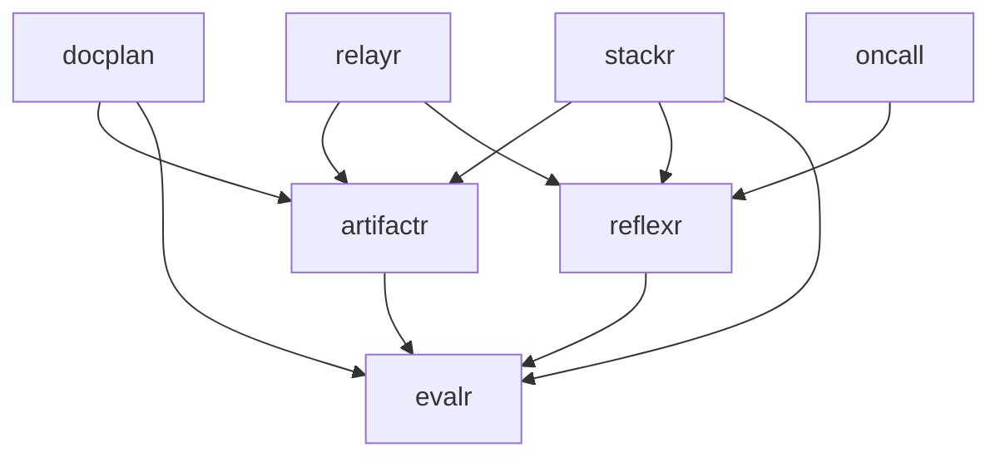

# Architecture

> **Status:** lattice has held the family's packages since 2026-09-30, as [stackr RFC-0003](stackr/rfcs/0003-one-repository-lattice.md) designed; its phases 1 and 2 are done. This document is evergreen: it describes lattice as it is, and is updated in the same pull request as what it describes. The family's decisions are recorded in [`adr/`](adr/README.md), and each package's in its own section. RFC-0003 is the design, and its [Tracking section](stackr/rfcs/0003-one-repository-lattice.md#tracking) lists where lattice departed from it.

## What lattice is

lattice is the family's one repository: five packages, two reference implementations, and one set of tools that checks, releases and documents them. It holds the packages, and changes nothing about what they are downstream. Each keeps its name, `pyproject.toml`, version, dependencies, extras, tests, 100% coverage gate, ADRs, RFCs, changelog and releases, and each installs on its own.

### Goals

- Every package stays installable on its own, and CI proves it on every change.
- The libraries stay independent ([reflexr ADR-0003](reflexr/adr/0003-independent-sibling-of-artifactr.md)), and checks enforce it, where repository walls used to.
- A change that spans packages lands in one pull request, tested with every package it can break.
- One of each: lock, CI, set of hooks, documentation site, dev container and release process.

### Non-goals (for now)

- A shared package for the code artifactr and reflexr keep verbatim ([Aligned with reflexr](artifactr/architecture.md#aligned-with-reflexr)). It would be the shared kernel that reflexr ADR-0003 deferred. In lattice, one pull request changes both copies.
- Publishing to PyPI ([#7](https://github.com/alexnodeland/lattice/issues/7)). Until then, a package installs from its tag, in a subdirectory of lattice ([Releases](#releases)).
- TypeScript. The Bun workspace RFC-0003 plans arrives with portalr's code.

## Layout

```text
lattice/
├── packages/
│   ├── artifactr/       artifactr-ai: src/, tests/, schemas/, deploy/ (its dashboards), scripts/, compose.yaml, compose.stackr.yaml, moon.yml, pyproject.toml, README.md, CHANGELOG.md, LICENSE
│   ├── reflexr/         the same shape
│   ├── evalr/
│   ├── relayr/          relayr-ai
│   └── stackr/          the stack and the application template: compose.yaml, supabase/, deploy/, scripts/, template/, copier.yml, versions.env, Makefile
├── examples/
│   ├── docplan/         artifactr's reference implementation, and its image
│   └── oncall/          reflexr's
├── docs/                the site: the family's pages, and docs/<package>/ for each package
├── scripts/             affected.py, standalone.py, check_site.py, griffe_sphinx_roles.py
├── tests/               the family's tests: the quality gates over all Python, and moon's edges
├── .devcontainer/       the dev container
├── .moon/               workspace.yml, and the tasks projects inherit
├── .github/             the workflows, issue forms and pull request template
├── pyproject.toml       the uv workspace's root: its members, the family's tools, and the shared ruff configuration
├── uv.lock              one lock for every package
├── moon.yml             the root project, lattice
├── mkdocs.yml           the site's one configuration
├── copier.yml           points Copier at stackr's template
├── Makefile             install, and check
├── .prototools, .python-version, .pre-commit-config.yaml, .prekignore, .git-blame-ignore-revs
├── renovate.json, release-please-config.json, .release-please-manifest.json, osv-scanner.toml
└── README.md, CONTRIBUTING.md, CODE_OF_CONDUCT.md, SECURITY.md, LICENSE
```

- **A package's directory holds what it ships and what builds it:** code, tests, schemas, dashboards, changelog and license. Its wheel and sdist ship its `LICENSE`; the root has the same one.
- **Its pages are at `docs/<package>/`,** its ADRs and RFCs included, so one build makes one site ([The docs site](#the-docs-site)).
- **The reference implementations are in `examples/`,** since uv refuses a workspace member inside another member. Each is a project of its own, with its own 100% gate.
- **The family's documents are at the root of `docs/`:** this one, the [family's ADRs](adr/README.md), and the project pages. Outside its package, an ADR or RFC is named with it, as in "reflexr ADR-0003", and the family's as "lattice ADR-0002".

## The projects

moon knows eight projects: the seven below, and `lattice`, the root, which holds the site and the family's own tests and scripts.

| Project | Path | What it is | Kind | Depends on |
|---|---|---|---|---|
| evalr | `packages/evalr` | Typed evaluation of agent systems | Library | |
| artifactr | `packages/artifactr` | Chat applications where people and agents share versioned artifacts; distributed as `artifactr-ai` | Library | evalr |
| reflexr | `packages/reflexr` | Rules over event streams that run LLM workflows | Library | evalr |
| relayr | `packages/relayr` | The bridge between artifactr and reflexr; distributed as `relayr-ai` | Library | artifactr, reflexr |
| stackr | `packages/stackr` | The stack the libraries run on, and the application template | Tool (shell), ships no wheel | artifactr, reflexr, evalr |
| docplan | `examples/docplan` | artifactr's reference implementation | Application | artifactr, evalr |
| oncall | `examples/oncall` | reflexr's reference implementation | Application | reflexr |



- **An edge is a requirement.** The dependent names its dependency in `[project]` and takes it from the workspace ([The uv workspace](#the-uv-workspace)). The libraries name their siblings with a range, which their wheels carry; docplan and oncall ship no wheel, and name theirs without one. docplan depends on evalr through its `[dspy]` extra.
- **stackr's edges are its template's:** it generates applications on the three libraries, and no `pyproject.toml` records that.
- **Each `moon.yml` states its `dependsOn`,** since moon infers no edge from a requirement with a range. [`tests/test_moon.py`](https://github.com/alexnodeland/lattice/blob/main/tests/test_moon.py) holds it to the siblings the project's `pyproject.toml` requires, and checks that each comes from the workspace.
- **Independence is checked, not assumed.** In one environment every member is importable, so an undeclared import that would once have failed passes silently. artifactr's and reflexr's layering tests list what each layer may import, evalr's forbid artifactr and reflexr, and deptry fails on an import that a package's shipped code doesn't declare.

## The uv workspace

The root `pyproject.toml` is a virtual project (`package = false`) whose members are `packages/*` and `examples/*`. It holds the family's tools, in its `dev` and `docs` dependency groups, and their shared configuration.

| | Where it lives |
|---|---|
| The lock | One `uv.lock`, one resolution for every package, extra and group. `uv sync --all-packages --all-groups --all-extras` installs them all into one `.venv`, and CI adds `--locked` |
| A sibling | A range in `[project]`, such as `evalr>=0.1.0.dev0`, and `{ workspace = true }` in `[tool.uv.sources]`, which only development sees. A built wheel carries the range and no path |
| ruff | One configuration, at the root; stackr extends it for its scripts |
| pyright | Per package, until ty replaces it with one root configuration (phase 6); the root's covers `scripts/` and `tests/` |
| pytest and coverage | Per project, since neither tool reads a parent directory's configuration |
| The quality test | One, at the root ([`tests/test_quality.py`](https://github.com/alexnodeland/lattice/blob/main/tests/test_quality.py)), over every package, `examples/` and the root's Python: no inline suppressions anywhere |

One resolution means every package agrees on every third-party version. Today that costs one hold: litellm stays at 1.83.0, and `osv-scanner.toml` records the advisories that don't apply ([ADR-0008](adr/0008-one-resolution-litellm-held-at-1-83-0.md)).

### Standalone packages

Every package that ships a wheel is tagged `distribution` in its `moon.yml`, and inherits three tasks that prove it installs outside lattice:

- **`build`** runs `uv build --no-sources --out-dir dist` from the package's directory, so the wheel and sdist are built as they are published, into the project's own `dist/`.
- **`standalone`** depends on the package's `build` and its dependencies'. [`scripts/standalone.py`](https://github.com/alexnodeland/lattice/blob/main/scripts/standalone.py) installs the wheel with every extra, and the siblings it needs as wheels by path, into a fresh environment outside the workspace; imports every module; and checks the version. uv checks every range between them, so a range that a sibling's version doesn't satisfy fails to resolve.
- **`deptry`** runs over `src/` from the package's directory. An undeclared import (DEP001, DEP003) or a development dependency used in shipped code (DEP004) fails. DEP002, unused dependencies, stays off, since extras such as `[postgres]` name drivers the library never imports.

`check` includes `standalone` and `deptry`.

## moon

moon runs every task, and only those a change affects; uv manages the dependencies, and moon never edits a manifest or the lock. moon's Python toolchain stays off until it is stable (RFC-0003, D3), so every Python task is a plain `uv run` command.

| File | Holds |
|---|---|
| `.moon/workspace.yml` | The eight projects, by path; `main` as the default branch; moon's version constraint |
| `.moon/tasks/python.yml` | For every Python project: `lint`, `typecheck`, `test`, `format` and `check`. The root's `pyproject.toml` and `uv.lock` are inputs of every task |
| `.moon/tasks/distribution.yml` | For every project tagged `distribution`: `build`, `standalone` and `deptry` |
| `<project>/moon.yml` | The project's language, layer, tags and `dependsOn`, and tasks of its own |
| `moon.yml` | The root project, `lattice`: lint, types and tests for the root's Python and the family's tests; `docs` and `docs-serve`; `workflows`, which runs actionlint and zizmor; and `check`. It inherits no Python task, which would check every package again |
| `.prototools` | The versions of moon and uv, which CI's `moonrepo/setup-toolchain` installs, and proto anywhere else. `detect-strategy = "only-prototools"` leaves Python to uv, from `.python-version` |

- **`check` is one task per project** that runs nothing itself and depends on the project's checks, so the list lives in one place. `make check` runs `moon run :check`, and CI and Nightly run the same tasks.
- **artifactr's and reflexr's contributor tasks,** `schema`, `dashboards`, `pg-up`, `pg-down`, `app-up` and `test-pg`, are ones CI doesn't run and moon doesn't cache (RFC-0003, D2). stackr keeps its Makefile for the stack, and its checks are tasks: `validate`, `reference`, `template`, `smoke` and `smoke-app`.
- **The reference implementations' `image` tasks** build each image from lattice's root, since it installs from the root's lock. The image's own `Dockerfile.dockerignore` lets in only the workspace's manifests, the lock, and the packages it installs, with the README and license their metadata names. Each starts its image on its library's PostgreSQL, and a mutex runs them one at a time.

### What a change affects

`moon ci --downstream deep` doesn't reach a dependent's tasks, and moon's affected projects miss changes to the root's files. So CI runs [`scripts/affected.py`](https://github.com/alexnodeland/lattice/blob/main/scripts/affected.py) ([ADR-0002](adr/0002-ci-runs-every-affected-project-and-its-dependents.md)):

1. It asks moon which projects the change touches, by their files and by their tasks' inputs, which include `uv.lock`, the root `pyproject.toml` and `.moon/`.
2. It adds every project that depends on one of them, all the way down, from the project graph.
3. It runs the task, `check`, `test` or `image`, in each of those projects that has it.

A change to evalr runs the checks of evalr and of every project above it; a change to `uv.lock` runs every package's. stackr's Template and Smoke run through `moon ci` instead, only when stackr's own inputs change: until phase 4, the template pins the libraries by revision, so a library's change can't reach what it generates.

## CI

| Workflow | Runs | Jobs |
|---|---|---|
| `ci.yml` | On pull requests | **Check** (Python 3.12): `check` in every affected project and its dependents, with PostgreSQL 17 and a database per library. **Tests** (Python 3.13 and 3.14): `test`, the same way. **Images**: `image`, the same way. **Template**: the application template's seven variants, each generated and checked as its own CI would. **Smoke**: the stack, started three ways, with telemetry sent through it, and in one of them an application from the template beside it. **Dependency review**. **OSV**: the advisories a change adds to `uv.lock`. **CI**: passes only when every other job does |
| `title.yml` | When a pull request is opened, edited, pushed to or reopened | **Title**: the title is a Conventional Commit |
| `nightly.yml` | On every push to `main`, every night, and by hand | Every project's `check`, whatever changed; the images; osv-scanner over `uv.lock`; lychee over every Markdown file's links |
| `docs.yml` | On every push to `main`, and by hand | Builds the site and deploys it to GitHub Pages |
| `release.yml` | On every push to `main` | release-please; then each released package's wheel, built, attested and attached |
| `renovate.yml` | Every day, and by hand | Renovate |

- **Two checks are required,** `CI` and `Title`, on branches up to date with `main`. The ruleset is the one `main` shares with the siblings' repositories: no deletion, no force push, linear history, and squash-only pull requests ([ADR-0003](adr/0003-ci-on-pull-requests-nightly-on-main-and-a-required-title-check.md)).
- **`main` is Nightly's.** CI runs on pull requests only, and `nightly.yml` runs everything on each push to `main`.
- **Every workflow is hardened the same way:** each action pinned to a commit, with its version beside it; `permissions: {}` at the top, and each job granted what it needs; and no checkout keeps its credentials. actionlint and zizmor check the workflows, in the hooks and in the root's `workflows` task.
- **Every test and every job has a timeout:** a test fails after a minute, printing every thread's stack, and each job has a limit of a few times its usual length ([ADR-0007](adr/0007-a-timeout-on-every-test-and-every-job.md)).
- **Every job that runs moon or uv installs them** through `moonrepo/setup-toolchain`, at the versions in `.prototools`.

## Hooks

prek runs the hooks in `.pre-commit-config.yaml`, and `make install` installs them. The Python tools run from `uv.lock` through `uv run`, so the hooks run the versions CI does.

- The hygiene hooks, leaving each `CHANGELOG.md` exactly as release-please writes it, and `uv.lock` out of the large-file check; JSON, shebangs and private keys, for every file.
- Conventional Commits, at `commit-msg`.
- ruff; yamllint and shellcheck for stackr's files; actionlint and zizmor for the workflows; and pyright, through `moon run :typecheck`, whose cache skips what a change doesn't touch.
- `.prekignore` leaves out `packages/stackr/template/`, whose hook configuration is the generated applications'.
- `.git-blame-ignore-revs` names the setup's commit that only sorted imports, and `make install` points `git blame` at it.

## Dependencies and advisories

- **Renovate** keeps the dependencies current ([ADR-0005](adr/0005-renovate-runs-in-lattices-own-actions.md)), from lattice's own Actions, as lattice's GitHub App ([ADR-0004](adr/0004-one-github-app-for-release-please-and-renovate.md)). `renovate.json` extends `config:best-practices`, which pins actions by commit and maintains the lock weekly. Python ranges stay as written and the lock moves within them, so a package's floors move by hand, with the code that needs them. A release waits three days, on PyPI as on npm. PostgreSQL stays at major 17, the version local Supabase runs. Its `proto` manager moves `.prototools`, and its `pre-commit` manager the hooks.
- **Advisories.** GitHub's dependency graph doesn't read `uv.lock`, so osv-scanner does: on each pull request for what it adds, and every night in full. [`osv-scanner.toml`](https://github.com/alexnodeland/lattice/blob/main/osv-scanner.toml) records what doesn't apply, each with its reason and a date by which it is reviewed again, and the matching Dependabot alerts are dismissed with the same reasons ([ADR-0008](adr/0008-one-resolution-litellm-held-at-1-83-0.md)). Dependabot's security updates are off.

## Releases

- **Versions are per package,** in each `pyproject.toml`.
- **release-please keeps one release pull request open** for every package with unreleased changes. Only features, fixes, performance changes, reverts and breaking changes cut a release; a package never released starts at 0.1.0; and a breaking change bumps the minor version before 1.0 ([ADR-0006](adr/0006-release-please-first-versions-pre-1-0-bumps-and-what-releases.md)).
- **Merging it releases each package it lists:** it tags `<package>-v<version>`, updates the package's version, in its `pyproject.toml` and in `uv.lock`, and its `CHANGELOG.md`, and creates the package's GitHub release. Each changelog keeps what came before lattice under "Before lattice".
- **`release.yml` then builds each released package that ships a wheel**, alone and as it is published (`uv build --no-sources`), attests its provenance, and attaches the wheel and sdist to its release. stackr is tagged and released, and ships no wheel.
- **Nothing is on PyPI yet** ([#7](https://github.com/alexnodeland/lattice/issues/7)); PyPI publishing would be a later job in `release.yml`. Downstream, a package installs from its tag, in its subdirectory, such as `git+https://github.com/alexnodeland/lattice@artifactr-v0.1.0#subdirectory=packages/artifactr`. uv takes the package's workspace siblings from the same repository and commit.
- **Copier sees no template release.** The tags are prefixed, and none parses as a version, so `uvx copier copy gh:alexnodeland/lattice` takes `HEAD`. The root `copier.yml` includes stackr's and points `_subdirectory` at its template.

## The docs site

**One site, one build, one `mkdocs.yml`,** at [lattice.alexnodeland.com](https://lattice.alexnodeland.com).

- **Zensical builds it** from `docs/`. The family's pages are at its root, and each package's at `docs/<package>/`. The `awesome-nav` plugin orders each folder by its `.nav.yml`, so each package's section keeps its own order. Each section starts at its package's home page, but for relayr's, which starts at its decisions until relayr has one.
- **The site is styled in lattice's brand** ([ADR-0001](adr/0001-lattices-brand.md), [`docs/assets/brand/`](assets/brand/README.md)), with the dark mark in the header in the dark scheme, and the site's home and each package's open with a lockup, but for relayr's section, which starts at its decisions.
- **`moon run lattice:docs` is the build:** strict, so a broken link or anchor fails it, then [`scripts/check_site.py`](https://github.com/alexnodeland/lattice/blob/main/scripts/check_site.py), which fails on a list that rendered as text. CI runs it on a pull request that changes the site's inputs, as the root project's `docs` task, and `docs.yml` deploys it from `main`, one run at a time, never cancelled.
- **One build resolves the references between packages.** mkdocstrings reads every package from the workspace's one environment, so no package needs another's inventory. [`scripts/griffe_sphinx_roles.py`](https://github.com/alexnodeland/lattice/blob/main/scripts/griffe_sphinx_roles.py) turns artifactr's and reflexr's Sphinx roles into cross-references; evalr's and relayr's docstrings are Markdown.
- **Pages include files instead of copying them,** by their path from the root: the family's `CONTRIBUTING.md`, code of conduct, security policy and license under `docs/project/`, each package's `CHANGELOG.md` and schemas, and the files stackr's reference pages describe, which `stackr:reference` checks the pages against.
- **Each package's README is also its PyPI page,** so its links are absolute: the site's pages, and files on GitHub.
- **The old sites,** at `artifactr.`, `reflexr.`, `evalr.` and `stackr.alexnodeland.com`, keep serving the old pages until they are retired separately (RFC-0003, D1).

## The dev container

One dev container, at the root, for every package ([ADR-0009](adr/0009-one-dev-container-at-the-root.md)). Docker runs inside it, for stackr's stack, the reference implementations and the PostgreSQL tests. It installs proto, which installs moon and uv from `.prototools`; Python 3.12 to 3.14 through uv; the workspace; and the hooks. The egress firewall, the prebuilt image and Codespaces come in phase 7.

## Decisions

Every family decision is an ADR in [`adr/`](adr/README.md), whose index lists them with their status, and RFC-0003's own are in its [Decisions](stackr/rfcs/0003-one-repository-lattice.md#decisions) section.

## What comes next

What remains of the move is RFC-0003's [phases](stackr/rfcs/0003-one-repository-lattice.md#phases) 4 to 7, which [#22](https://github.com/alexnodeland/lattice/issues/22) tracks.
