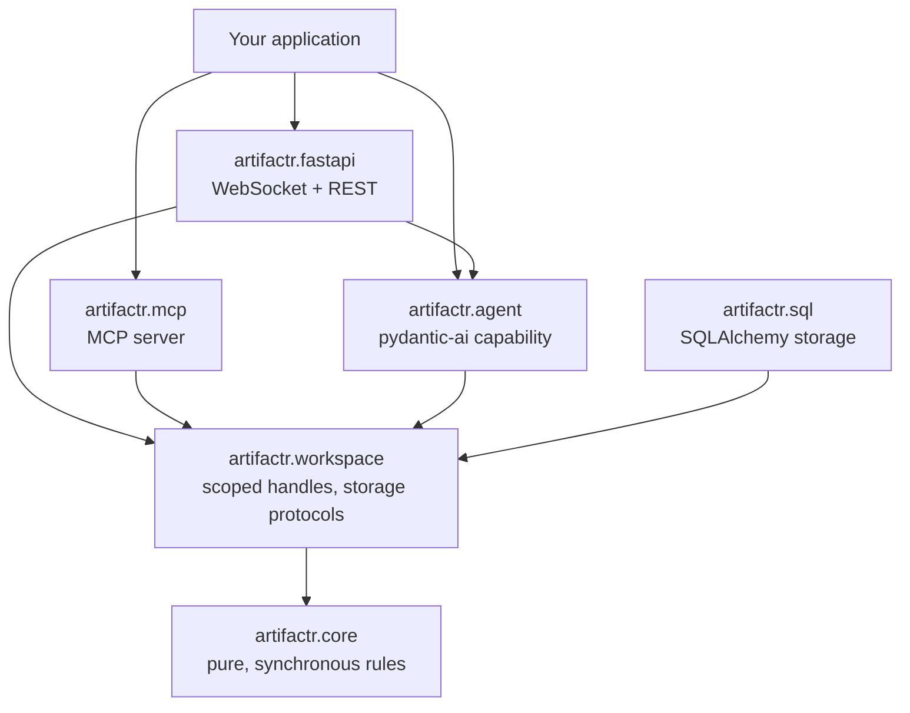
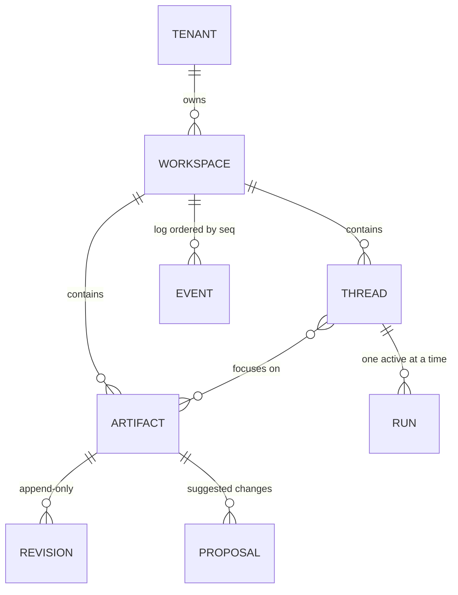
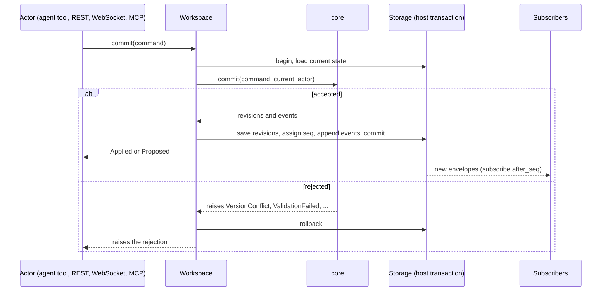

# Architecture

> **Status:** accepted design, being built in the phases tracked by [RFC-0001](rfcs/0001-v0.1-implementation-plan.md). This document is evergreen: it is updated in the same pull request as the code that changes it, and the table below shows what exists today. Decisions are recorded in [`adr/`](adr/README.md), proposals in [`rfcs/`](rfcs/README.md), and the wire protocol in [`protocol.md`](protocol.md).

| Package | Status |
|---|---|
| `artifactr.core` | Implemented |
| `artifactr.workspace` | Implemented, with in-memory storage |
| `artifactr.agent` | Implemented |
| `artifactr.sql` | Planned (phase 4) |
| `artifactr.fastapi`, `artifactr.mcp` | Implemented |
| `examples/docplan` | Planned (phase 6) |

## What artifactr is

artifactr is a Python library for building chat applications in which a person and an agent collaborate through **shared, mutually editable artifacts**: documents, plans, specs, datasets, anything with structure.

The chat is one channel of communication. The artifacts are a second one. When the agent restructures a plan, or a person rewrites a paragraph the agent drafted, the edit says something about how each side is thinking. artifactr makes those edits first-class: versioned, attributed to whoever made them, visible to every participant, and fed back into the agent's context.

The library provides the machinery; applications provide the artifact types. A reference implementation, [`examples/docplan`](#build-plan) (a Markdown document plus a structured plan), is built on the library's public API as one implementation of it.

### Goals

- Downstream projects define an artifact type by subclassing a Pydantic model. Versioning, conflict handling, change history, agent tools and transports come from the library.
- Every change, from any participant, takes the same path and produces the same events.
- The agent always knows what changed since it last looked, and who changed it.
- Multi-tenant, with many concurrent chats sharing a workspace's artifacts.
- Idiomatic use of Pydantic, pydantic-ai, SQLAlchemy, FastAPI and the MCP SDK, rather than parallel abstractions next to them.
- Small: six core concepts, readable in an afternoon.

### Non-goals (for now)

- Character-level real-time co-editing (CRDTs). Optimistic concurrency with patches covers turn-based collaboration; CRDT-backed types can come later behind the same interfaces.
- A frontend. The protocol is specified and typed; applications build their own UIs.
- Hosting or deployment tooling.

## Core concepts

| Concept | What it is |
|---|---|
| **Actor** | Who did something: a user, the built-in agent (per run), an external agent connected over MCP, or the system. Every event is attributed to one. |
| **Artifact** | A Pydantic model subclass that defines one artifact type. Stored instances are `Versioned[T]`: the data plus its id, version and last actor. |
| **Command** | An intent to change the workspace: edit an artifact, propose an edit, answer a proposal, post a message. Commands can be rejected. |
| **Event** | A fact that happened, appended to the workspace's log with a sequence number (`seq`). Events are never rejected or rewritten. |
| **Workspace** | A tenant-scoped handle over artifacts, threads and the event log. The only way to read or write. |
| **Session** | The pydantic-ai dependencies for one agent run: a workspace handle bound to the agent's actor, the thread, the artifacts in focus, and the application's own deps. |

Supporting types: `Envelope` (an event plus its `seq`, actor, timestamp and scope), `Proposal` (a suggested change awaiting a decision), and `Thread` (a chat).

## Layers



Dependencies point one way. Each layer is usable without the ones above it.

| Package | Depends on | Responsibility |
|---|---|---|
| `artifactr.core` | pydantic, jsonpatch | Every rule. Pure, synchronous, no I/O, no pydantic-ai. |
| `artifactr.workspace` | core | `Workspaces`, `Workspace`, storage protocols, in-memory storage. |
| `artifactr.sql` (extra) | workspace, SQLAlchemy 2 async | Durable storage and migrations. |
| `artifactr.agent` | workspace, pydantic-ai | The `ArtifactWorkspace` capability, `Session`, live-output helpers. |
| `artifactr.fastapi` (extra) | agent, FastAPI | The thread protocol over WebSocket, and REST commands. |
| `artifactr.mcp` (extra) | workspace, mcp | Artifacts as MCP resources, commands as MCP tools. |

### `artifactr.core`: sans-IO

Core holds every rule as plain functions over immutable values. Storage and transport belong to the host, which asks core what to load, loads it, lets core decide, and saves what core returns inside its own transaction ([ADR-0018](adr/0018-core-host-contract.md)):

```python
state = State()
while missing := core.needs(command, actor=actor, state=state):
    state = load(missing, into=state)  # the host's I/O
result = core.commit(command, state, actor=actor)  # CommitResult, or raises a Rejection
save(result)  # entities and events, in one transaction
```

- `needs` returns the ids of the artifacts, proposals, threads and runs a command depends on. Some commands only know their full needs once their first entities are loaded (accepting a proposal needs the proposal before it knows which artifact), so hosts loop until nothing is missing.
- `commit` decides a command. For artifact changes it applies the type's write policy, checks the base version, applies the patch, and validates the result against the type. It returns a `CommitResult`: the outcome (`Applied`, `Proposed`, `Resolved` or `Recorded`), the entities to save, the revisions to append, and the events to log. Accepting or rejecting a proposal is the `RespondToProposal` command; an accepted change is rebased onto the artifact's current version, with the person's own changes layered on top.
- `record` decides a fact about an agent run (`RunStarted`, `ToolCalled`, `ToolReturned`, `RunPaused`, `RunEnded`) or an application `AppEvent`. Only the thread's own agent, or the system, may record facts about its runs.
- `change_notes` turns a slice of the log into short, attributed notes for a viewer. It keeps changes by other participants to the artifacts the viewer follows (and artifacts created in the viewer's thread), proposals others made on them, and decisions on the viewer's own proposals; several changes to one artifact become one note.
- `resume` decides where a reconnecting client's replay starts, and whether it must reset because it has seen events the log does not have.

Commands carry the ids of everything they create, including the proposal id to use if a write policy turns the change into a proposal. The same command against the same state therefore always yields the same result. Ids are plain strings; aliases such as `ArtifactId` document intent.

Rejections are exceptions with a stable `code` and typed details: `VersionConflict` (`base`, `head`), `ValidationFailed` (Pydantic's `errors`), `PatchFailed`, `NotFound` (`entity`, `id`), `Forbidden`, `InvalidState`, and `UnsupportedProtocol`. Their `payload()` is what the protocol sends to clients.

Because core is pure, its behaviour is pinned by a **conformance suite** of JSON fixtures in `tests/conformance/cases/`: given an actor, the entities that exist and a command, expect these events and entities or this rejection. The fixtures are the language-neutral specification. Any future port of core, or a hot path rewritten as a native extension, must pass them.

Core events form a **closed** discriminated union (`KnownEvent`), so pyright checks `match event:` blocks ending in `assert_never` for exhaustiveness. Applications extend the log through one **open** family, `AppEvent`. An event type from a newer protocol version validates as `UnknownEvent` rather than failing, and round-trips unchanged. This mirrors how pydantic-ai separates its own events from application `CustomEvent`s.

### Defining an artifact type

```python
from typing import ClassVar, Literal, Self

from pydantic import BaseModel

from artifactr import Artifact, MarkdownArtifact, WritePolicy, new_id


class Task(BaseModel):
    title: str
    status: Literal["todo", "doing", "done"] = "todo"


class Plan(Artifact):  # registered as "plan"
    write_policy: ClassVar[WritePolicy] = "propose"

    goal: str = ""
    tasks: dict[str, Task] = {}  # keyed by id, so patch paths stay stable

    def add_task(self, title: str) -> str:
        task_id = new_id()
        self.tasks[task_id] = Task(title=title)
        return task_id

    def render_for_agent(self) -> str:
        lines = [f"Goal: {self.goal}"]
        lines += [f"- [{t.status}] {t.title} ({tid})" for tid, t in self.tasks.items()]
        return "\n".join(lines)

    def describe_change(self, before: Self) -> str | None:
        done = [
            t.title
            for tid, t in self.tasks.items()
            if t.status == "done" and tid in before.tasks and before.tasks[tid].status != "done"
        ]
        return f"completed {', '.join(done)}" if done else None


class Doc(MarkdownArtifact):  # registered as "doc"; edited with anchored text replacements
    pass
```

Registration happens in `__pydantic_init_subclass__`, Pydantic's hook that runs after the model's fields are built. The type name is derived from the class name in snake case and can be overridden with `class Plan(Artifact, name="...")`, the same convention pydantic-ai uses for `CustomEvent`. Intermediate base classes pass `abstract=True`. `describe_change(before)` is an optional hook that summarizes a change in the type's own words; without it, the summary is generated from the patch.

The library defines the patch kinds:

- **JSON Patch** (RFC 6902) for `Artifact` subclasses. `Versioned[T].edit(fn)` copies the data, lets `fn` mutate the copy, and diffs the result into a patch against the current version.
- **Anchored text edits** for any text field, such as a `MarkdownArtifact`'s `text`. Each edit replaces an exact string that must occur exactly once, the edit form language models perform most reliably. An empty anchor writes into an empty field.

Agents do not write raw JSON Patch. They get domain tools from the application (`add_task`, `set_status`) or the generic text-edit tool for documents, and those tools produce patches.

```python
plan = await ws.get(Plan, plan_id)  # Versioned[Plan]
outcome = await ws.commit(plan.edit(lambda p: p.add_task("Ship v1")))
```

## Data model



- **Artifacts belong to the workspace**, not to a chat, so several chats and people can work on the same plan. A thread lists the artifacts it is focused on.
- **Revisions are append-only.** Every committed change writes a revision with its version, patch, resulting data and actor. Reverting writes a new revision; versions never go backwards.
- **One event log per workspace**, with a single gap-free `seq`. Events carry an optional `thread_id` and `run_id`, and subscribers filter on them.
- **Proposals** are durable objects that wrap the command they would execute (create, edit or archive), with its base version, the proposer and a rationale.
- **Model history** (pydantic-ai `ModelMessage`s, serialized with `ModelMessagesTypeAdapter`) is stored per thread next to the log, not reconstructed from it.

## The write path

Every change, whether from the built-in agent, a person in a UI, an external agent over MCP, or a script, goes through one path.



`Workspace.commit` returns the command's outcome with the `seq` of its last event: `Applied(artifact_id, version)` when a change was written, `Proposed(proposal_id)` when the artifact type's write policy turned it into a proposal, `Resolved(proposal_id, decision, version)` for an answered proposal, and `Recorded()` for everything else. Run lifecycle facts (a run started, a tool was called) are recorded through `Workspace.record`, which calls `core.record` under the same transaction and sequencing. Nothing else writes to storage.

As a result:

- No surface has its own copy of accept, merge or validation logic.
- A person's edit is as visible to the agent as the agent's edit is to the person.
- The host's transaction can include its own tables, because core never touches storage.

## The agent

artifactr plugs into pydantic-ai as one **capability**, `ArtifactWorkspace` ([ADR-0006](adr/0006-agent-integration-as-pydantic-ai-capability.md)). A turn is an ordinary `agent.run(...)`, and the capability composes with any others the application uses. A `Runner` drives runs in threads for the surfaces ([ADR-0020](adr/0020-running-agents-in-threads.md)).

```python
agent = Agent(
    "anthropic:claude-sonnet-5-5",
    deps_type=Session[AppDeps],
    toolsets=[plan_tools],  # the application's own tools
    capabilities=[ArtifactWorkspace(types=[Doc, Plan])],
)
runner = Runner(agent, app=AppDeps(...))

handle = await runner.send(workspace, thread_id, "Draft a launch plan")
```

| Capability hook | What `ArtifactWorkspace` does |
|---|---|
| `get_toolset` | The generic tools: `list_artifacts`, `read_artifact`, `create_artifact`, `edit_text` (which can also propose), `archive_artifact`, and optionally `ask_user`. Their definitions never change, so the prompt cache stays warm. Application toolsets are registered on the agent itself ([ADR-0017](adr/0017-application-toolsets-and-capability-events.md)). |
| `get_instructions` | Renders, fresh from storage for every model request, the artifacts the thread follows, the kinds of artifact the agent can create, the thread's mode, and the agent's proposals awaiting review. |
| `wrap_run` | Records `run_started`, then briefs the agent: change notes since the thread's last-seen `seq` are enqueued before the first request. Watches the log for the run's duration (see below). When the run ends, records the agent's reply as `message_posted`, then `run_paused` with the deferred requests or `run_ended` with usage, storing the run's new `ModelMessage`s in the same transaction. A cancelled run is recorded as `stopped`, and one that raised as `failed`. |
| `before_tool_execute`, `wrap_tool_execute`, `after_tool_execute` | Record every tool call and its result, the application's tools included, as `tool_called` and `tool_returned`: `ok`, `retry` (a rejection, or the tool's own `ModelRetry`) or `error` (`ToolFailed`, or an exception that fails the run). |
| `on_tool_execute_error` | Turns any `Rejection` into `ModelRetry` with the rejection's message (for a `VersionConflict`, adding "read the artifact again"), so tools never catch rejections themselves. Other exceptions are recorded and fail the run. |

Tools are plain pydantic-ai tools over `RunContext[Session]`:

```python
plan_tools = FunctionToolset[Session[AppDeps]]()


@plan_tools.tool
async def add_task(ctx: RunContext[Session[AppDeps]], plan_id: str, title: str) -> str:
    """Add a task to a plan."""
    plan = await ctx.deps.workspace.get(Plan, plan_id)
    match await ctx.deps.workspace.commit(plan.edit(lambda p: p.add_task(title))):
        case Applied(version=version):
            return f"Added. The plan is now at version {version}."
        case Proposed(proposal_id=proposal_id):
            return f"Proposed adding the task ({proposal_id}); the user will review it."
```

`ctx.deps.workspace` acts as the agent (an `AgentActor` for this thread and run), so everything a tool commits is attributed to it. Reading, creating or editing an artifact through the generic tools also adds it to the thread's focus, so the agent hears about later changes to it.

Application tools emit ephemeral progress with `ctx.emit(...)`. `ArtifactDraft(kind=..., snapshot=...)` is a ready-made `CustomEvent` for a draft of an artifact being generated; other `CustomEvent`s reach live channels as `app_live` frames. Neither ever reaches the log.

### Change notes and steering

- When a run starts, the agent receives the notes it has missed, such as *"Alice changed plan_1 (plan, v7 → v8): completed Ship v1"*. They cover only the artifacts the thread follows (plus artifacts created in the thread), exclude the agent's own changes, and are delivered as a user-prompt part wrapped in `<workspace-changes>` tags, so they are stored in history with the rest of the conversation.
- The last-seen point is the `seq` at which the thread's history was last saved, so nothing is reported twice and nothing is skipped.
- While a run is in progress, a watcher subscribes to the log. Others' changes to followed artifacts are delivered the same way, and a new message in the thread is delivered as-is: a person can steer a long run without stopping it. Both use `ctx.enqueue(priority="asap")`, so they reach the model at its next request.

### Proposals and pausing

- Each artifact type declares a `write_policy`: `"direct"` or `"propose"`. A thread can be switched into suggest mode, which forces proposals for every type. `edit_text(..., propose=True)` proposes explicitly.
- Proposals do not block the run. The agent keeps working; the person accepts, rejects or edits the proposal whenever and from any surface; the outcome reaches the agent as a change note. When a proposal is accepted with edits, the note includes the person's changes.
- Blocking points use pydantic-ai's deferred tools: `ask_user` (or any tool raising `CallDeferred`) asks a question, and tools declared `requires_approval=True` need approval. The agent's `output_type` must include `DeferredToolRequests`. The run ends with `DeferredToolRequests`, recorded as `run_paused` with its history. Answers arrive as `answer_deferred` commands from any surface; once every request is answered, `Runner.resume` continues the run under the same `run_id` with `deferred_tool_results`. The pause survives restarts because nothing waits in memory.
- A chat message sent while a run is paused is the reply: it answers the pending questions and declines pending approvals with the message as the reason, and the run resumes. The conversation history therefore never ends in an unanswered tool call.

## Live output

The event log carries durable domain events only. Token-level output belongs to whoever drives the run ([ADR-0007](adr/0007-caller-owned-live-output.md)). pydantic-ai hands the run's event stream to its caller through `event_stream_handler`, and `forward_live(channel)` sends it to a `LiveChannel` as protocol live frames:

```python
await agent.run(
    prompt,
    deps=Session.start(workspace, thread_id, app=deps),
    message_history=await load_history(workspace, thread_id),
    event_stream_handler=forward_live(channel),  # caller-owned
)
```

The `Runner` does this for every run it starts, sending frames to its `FanoutChannel`, an in-process fan-out keyed by `run_id`. It keeps each active run's frames (bounded), so any connection can `runner.watch(run_id)` mid-run and receive what the run has produced so far, then the rest until it ends; watchers that fall behind lose their oldest frames rather than slowing the run. `NullChannel` drops frames for headless runs, and a pub/sub channel (Redis, NATS) can fan out across replicas.

The run holds a thread claim, not a socket: if the connection that started it drops, the run continues. Losing live frames is harmless, because the durable `message_posted`, `tool_returned` and `artifact_changed` events are authoritative. A client that reconnects mid-run replays the log from its last `seq` and watches the run again if it is still active.

## Tenancy and concurrency

- **Scoped handles.** `await workspaces.open(tenant_id, workspace_id, actor=...)` returns a `Workspace` bound to that tenant, workspace and actor. Nothing below it accepts a raw tenant id, so a query that crosses tenants cannot be written. Postgres row-level security can be layered underneath as defence in depth.
- **Actors are bound to handles.** `ws.as_actor(agent_actor)` returns a handle for the agent, and commits through it are attributed to the agent.
- **Type allowlist.** `Workspaces(storage, types=[Doc, Plan])` rejects creating any other artifact type, even one registered elsewhere in the process.
- **Optimistic concurrency.** Every edit names the version it was based on. A stale edit is rejected with the changes made since, so the agent retries against fresh state and a UI can rebase or ask the person.
- **One active run per thread**, enforced by `Workspace.claim_thread`: a storage lease with a time-to-live, renewed while held, that works across replicas and lapses if its holder dies. Concurrency happens across threads. A message sent during a run steers it instead of queueing.
- **Sequencing.** `seq` is assigned inside the commit transaction (`UPDATE workspace SET head_seq = head_seq + :n RETURNING head_seq`), giving a gap-free total order per workspace. This serializes commits within one workspace; tokens are not in the log, so commit volume stays modest.

## Surfaces

Every surface is a thin adapter: it authenticates, turns its input into commands, and hands them to `Runner.execute` ([ADR-0022](adr/0022-surfaces-over-one-command-handler.md)). Messages therefore start, steer or answer runs the same way everywhere, and every other command is a plain `Workspace.commit`.

| Surface | Package | Role |
|---|---|---|
| WebSocket | `artifactr.fastapi` | The thread protocol ([`protocol.md`](protocol.md)): `hello` and `welcome`, replay from a `seq` then live events on one subscription, command frames and results, and live frames for runs in followed threads or on request. |
| REST | `artifactr.fastapi` | The same command frames at `POST .../commands`, and reads of artifacts, revisions, the log, threads, proposals and runs. |
| MCP | `artifactr.mcp` | External agents join as `ExternalAgentActor`s: artifacts are resources at `artifactr://{tenant}/{workspace}/artifacts/{id}`, commands are tools, and artifact changes become resource-updated notifications on the server's `SubscriptionBus`. |

```python
app = FastAPI(lifespan=lifespan)
app.include_router(artifactr_router(workspaces, runner, resolve_actor=resolve_actor), prefix="/v1")

mcp = ArtifactrMcp(workspaces, runner, resolve=resolve_client)
app.mount(
    "/mcp", mcp.http_app(streamable_http_path="/")
)  # run mcp.lifespan() in the app's lifespan
```

The WebSocket session reads with a single task and runs each command as its own task, so a `stop_run` is never stuck behind a slow command. All outgoing frames pass through one bounded outbox and one writer; a client too slow to keep up is disconnected (close code 4429) rather than holding events back, and resumes by `seq` when it reconnects. Recently seen `command_id`s are remembered per process, so a retried command returns its original result.

The protocol's frames are Pydantic models in `artifactr.core.protocol`. `schemas/artifactr.v1.json` is generated from them (`make schema`) for clients to generate types from, and a test fails if it drifts.

pydantic-ai's AG-UI and Vercel AI adapters may be added later as compatibility surfaces for simple frontends. They are request-scoped with client-supplied state, so they sit beside the thread protocol rather than replacing it.

## Storage protocols

One protocol, `Storage`, covers everything a workspace persists ([ADR-0019](adr/0019-storage-protocol-and-workspace-handles.md)). Every method takes a `Scope` (tenant and workspace); `Workspace` handles hold the scope so application code never passes it.

```python
class Transaction(Protocol):
    async def load(self, needs: Needs) -> State: ...
    async def save(
        self, result: CommitResult, *, actor: Actor
    ) -> list[Envelope]: ...  # assigns seq
    async def append_history(self, thread_id: ThreadId, messages: bytes) -> None: ...


class Storage(Protocol):
    def transaction(self, scope: Scope) -> AbstractAsyncContextManager[Transaction]: ...
    async def read(
        self, scope: Scope, *, after_seq: int = 0, limit: int | None = None
    ) -> list[Envelope]: ...
    def subscribe(self, scope: Scope, *, after_seq: int = 0) -> AsyncIterator[Envelope]: ...
    async def acquire_lease(self, scope: Scope, key: str, holder: str, ttl: timedelta) -> bool: ...

    # plus reads: artifact(s), revisions, thread(s), proposal(s), run, head_seq, history
```

- **Transactions serialize per workspace from the moment they begin**, so what a transaction loads cannot change before it saves. Writes are staged and applied atomically when the block exits normally; an exception rolls back entities, log and history together.
- **`subscribe(after_seq)` replays, then follows live**, on one iterator. Because a subscription starts from a `seq`, there is no gap to manage between history and live events. It is the only read path for replay, live fan-out, hooks, MCP notifications and change notes.
- **Leases** back `Workspace.claim_thread`: a time-limited, renewed claim that holds across processes and lapses if its holder dies.
- **History** is opaque bytes (pydantic-ai `ModelMessage`s serialized by the agent layer), appended in the same transaction as the run fact that ends each run segment.

Two implementations ship:

- **`InMemoryStorage`** (`artifactr.workspace`), for tests, examples and single-process prototypes. A per-workspace `asyncio.Lock` serializes transactions and an `asyncio.Condition` wakes subscribers. Its clock is injectable, so tests control lease expiry.
- **`SqlStorage`** (`artifactr.sql`, planned for phase 4): SQLAlchemy 2 async with Alembic migrations, locking the workspace row per transaction.

The workspace behaviour suite in `tests/workspace/` runs against every implementation.

## Dependencies

| Dependency | Used for | Current major (2026-09) |
|---|---|---|
| pydantic | Artifact types, commands, events, JSON Schema | 2.13 |
| jsonpatch | RFC 6902 apply and diff in core | 1.33 |
| pydantic-ai-slim | Agent runtime: capabilities, toolsets, deferred tools, message history | 2.51 |
| SQLAlchemy (asyncio) | SQL storage | 2.1 |
| FastAPI | WebSocket and REST adapter | 0.141 |
| mcp | MCP server (`MCPServer`, subscriptions) | 2.2 |

Python 3.12+. Tooling: uv, ruff, pyright in strict mode, pytest.

Observability uses pydantic-ai's built-in OpenTelemetry instrumentation. The capability adds tenant, workspace, thread and run as span attributes.

## Testing

- **Core:** conformance fixtures, plus property tests (hypothesis) that patches round-trip: applying `diff(a, b)` to `a` gives `b`.
- **Workspace:** one suite runs against both in-memory and SQL storage.
- **Agent:** scripted runs with pydantic-ai's `TestModel` and `FunctionModel`, so no test calls a model API. Assertions are on the events written, including conflicts, steering and deferred pauses.
- **Adapters:** WebSocket contract tests with FastAPI's `TestClient`, and an MCP client round-trip.
- **Protocol:** the JSON Schema in `schemas/` is generated from the models and checked in. CI fails if it drifts.

## Build plan

The phases, their exit criteria and their progress are tracked in [RFC-0001](rfcs/0001-v0.1-implementation-plan.md).

1. `artifactr.core` and its conformance fixtures.
2. `artifactr.workspace` with in-memory storage.
3. `artifactr.agent` on pydantic-ai 2.x.
4. `artifactr.sql` and migrations.
5. `artifactr.fastapi` and `artifactr.mcp`, plus protocol schema generation.
6. `examples/docplan` and the CLI.
7. The documentation website and brand.

## Decisions

| ADR | Decision |
|---|---|
| [0001](adr/0001-python-library-with-sans-io-core.md) | Python library with a sans-IO core |
| [0002](adr/0002-single-write-path.md) | One write path: commands through `Workspace.commit` |
| [0003](adr/0003-artifact-types-as-pydantic-subclasses.md) | Artifact types are Pydantic subclasses with library-defined patch kinds |
| [0004](adr/0004-optimistic-concurrency-and-revisions.md) | Optimistic concurrency and append-only revisions |
| [0005](adr/0005-one-event-log-per-workspace.md) | One durable event log per workspace |
| [0006](adr/0006-agent-integration-as-pydantic-ai-capability.md) | Agent integration as a pydantic-ai capability |
| [0007](adr/0007-caller-owned-live-output.md) | Live output is owned by the caller, not the log |
| [0008](adr/0008-agent-perception-and-steering.md) | Agent perception: change notes, fresh rendering, steering |
| [0009](adr/0009-write-policies-and-non-blocking-proposals.md) | Write policies and non-blocking proposals |
| [0010](adr/0010-pausing-with-deferred-tools.md) | Pausing with pydantic-ai deferred tools |
| [0011](adr/0011-workspace-scoped-artifacts-and-tenant-handles.md) | Workspace-scoped artifacts and tenant-scoped handles |
| [0012](adr/0012-surfaces-websocket-rest-mcp.md) | Surfaces: WebSocket thread protocol, REST commands, MCP |
| [0013](adr/0013-library-with-reference-implementation.md) | A library with adapters and a reference implementation |
| [0014](adr/0014-trunk-based-development-with-rfcs-and-adrs.md) | Trunk-based development with RFCs, ADRs and evergreen docs |
| [0015](adr/0015-quality-gates.md) | Quality gates |
| [0016](adr/0016-mit-license.md) | MIT license |
| [0017](adr/0017-application-toolsets-and-capability-events.md) | Application toolsets register on the agent; the capability emits capability events |
| [0018](adr/0018-core-host-contract.md) | Core's host contract: needs, commit and record |
| [0019](adr/0019-storage-protocol-and-workspace-handles.md) | One storage protocol behind workspace handles |
| [0020](adr/0020-running-agents-in-threads.md) | Running agents in threads |
| [0022](adr/0022-surfaces-over-one-command-handler.md) | Surfaces over one command handler |

## Open questions

- **Log retention.** When old envelopes are compacted, `resume` falls back to a snapshot. The snapshot format is not yet specified.
- **Very hot workspaces.** Assigning `seq` serializes commits per workspace. If that becomes a bottleneck, the log could be sharded by artifact group behind the same per-workspace cursor.
- **Change-note volume.** With many concurrent chats, notes may need coalescing beyond focus filtering.
- **Crash recovery for runs.** A run interrupted by a process crash is recorded as failed when its lease expires. pydantic-ai's durable execution integrations (Temporal, DBOS, Prefect) could make such runs resumable.
- **Cross-process runs.** Runs are tasks in the process that started them, so `Runner.stop` and `Runner.watch` reach only local runs. A pub/sub channel would make both work across replicas.
- **`jsonpatch` maintenance.** It is stable but rarely updated; its surface is small enough to vendor if needed.
