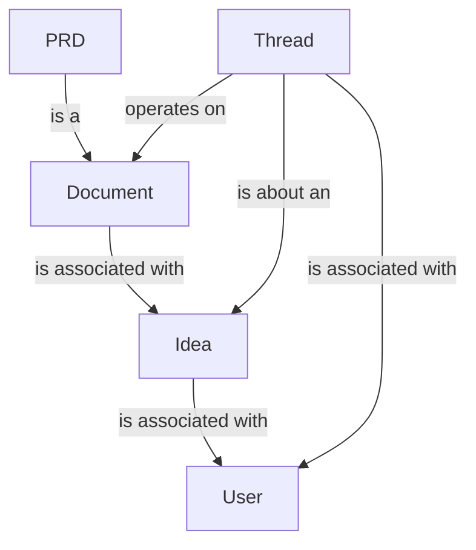

# Data Model

## Main Objects

- `User`: Represents a user in the system.
- `Idea`: Represents an idea submitted by a user.
- `PRD`: Represents a Product Requirements Document associated with an idea.
- `Document`: Represents a document associated with a PRD.

