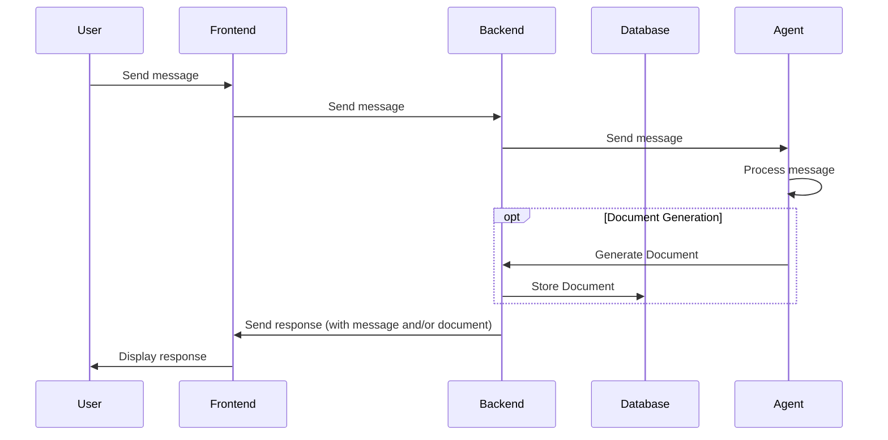

# Interactions

This document is a sketch of the interactions between the frontend and backend of the system.

## CRUD Endpoints

Update the ideas and documents in the database directly, from the frontend.

Document:

Sub router for each document type (PRD, Idea, etc.):

## Agent Endpoints

Chat with the agent, with the ability to generate PRDs and documents.

