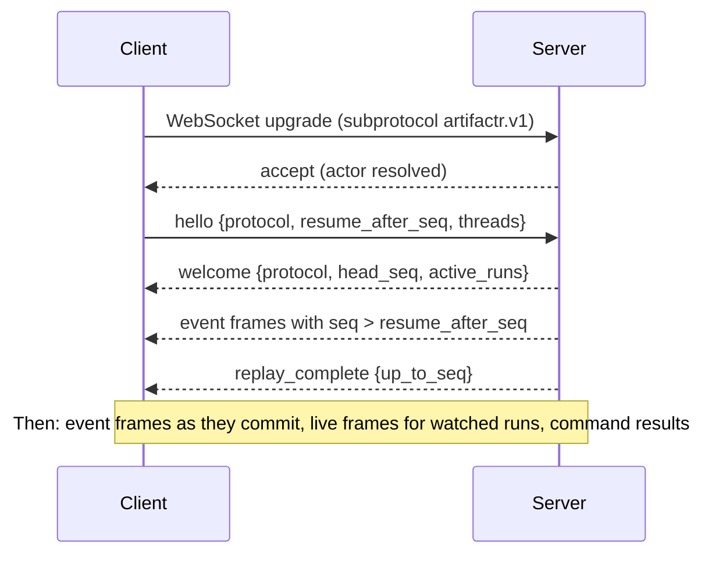

# Thread protocol v1

> **Status:** draft. Field names may change before the first release; the structure is settled by [ADR-0005](adr/0005-one-event-log-per-workspace.md), [ADR-0007](adr/0007-caller-owned-live-output.md) and [ADR-0012](adr/0012-surfaces-websocket-rest-mcp.md).

Clients connect to a workspace over WebSocket. They receive the workspace's durable events with resume, send commands, and receive live frames for runs they are watching. REST exposes the same commands and the same reads.

## Connection

- **Endpoint:** `GET /v1/workspaces/{workspace_id}/stream`, upgraded to WebSocket with subprotocol `artifactr.v1`.
- **Authentication** is resolved by the host application before the socket is accepted. The host supplies `resolve_actor(request) -> (tenant_id, Actor)`; failure closes the socket with `4401`.
- **Frames** are UTF-8 JSON text frames, one message per frame.
- **One reader per socket.** The server reads inbound frames in a single loop and never awaits long work in it. Commands are dispatched as tasks, so a `stop_run` is never stuck behind a slow command.

## Handshake and resume



```json
{"type": "hello", "protocol": "artifactr.v1", "resume_after_seq": 1041, "threads": ["thr_9"]}
```

```json
{
  "type": "welcome",
  "protocol": "artifactr.v1",
  "workspace_id": "ws_1",
  "head_seq": 1057,
  "reset": false,
  "active_runs": [{"run_id": "run_42", "thread_id": "thr_9"}]
}
```

- **The server owns the protocol version.** An unsupported `protocol` closes the socket with `4400`.
- **Resume is by `seq`, never by timestamp.** The server subscribes to the log from `resume_after_seq` before replaying, so no event can fall between replay and live delivery.
- `resume_after_seq` of `0` replays from the beginning of retained history. If the client has seen events this log does not have (its position is past `head_seq`, for example after the server's data was reset), or the position is older than retention, `welcome` carries `reset: true`: the client discards what it holds and rebuilds from the replay. The decision is `artifactr.core.resume`.
- `threads` filters thread-scoped events (messages, runs). Workspace-scoped events (artifacts, proposals) are always delivered.
- A `hello` not received within the server's timeout closes the socket with `4408`.

## Server frames

### `event`: durable

Every durable event arrives in the same envelope. The stored envelope and the wire frame have the same shape; the models are `Envelope` and `Event` in `artifactr.core`.

```json
{
  "type": "event",
  "seq": 1042,
  "id": "6f1c0f7e-3b0e-4a8a-9d7b-1a2b3c4d5e6f",
  "ts": "2026-09-28T14:03:11.204Z",
  "workspace_id": "ws_1",
  "thread_id": "thr_9",
  "run_id": "run_42",
  "actor": {"kind": "agent", "thread_id": "thr_9", "run_id": "run_42", "name": "assistant"},
  "event": {
    "type": "artifact_changed",
    "artifact_id": "plan_1",
    "kind": "plan",
    "version": 8,
    "patch": {"kind": "json_patch", "ops": [{"op": "replace", "path": "/tasks/t3/status", "value": "done"}]},
    "summary": "completed Ship v1",
    "proposal_id": null,
    "thread_id": "thr_9",
    "run_id": "run_42"
  }
}
```

`actor.kind` is one of `user` (`id`, `name?`), `agent` (`thread_id`, `run_id?`, `name`), `external_agent` (`client_id`, `name?`) or `system` (`name`). Every event of one thread's agent is the same participant, whatever its run.

| `event.type` | Scope | Fields |
|---|---|---|
| `thread_created` | thread | `thread_id`, `title` |
| `thread_mode_changed` | thread | `thread_id`, `mode` (`edit`, `suggest`) |
| `focus_changed` | thread | `thread_id`, `artifact_ids` |
| `message_posted` | thread | `thread_id`, `message_id`, `content`, `run_id?`. The author is the envelope's actor. |
| `artifact_created` | workspace | `artifact_id`, `kind`, `version`, `data`, `proposal_id?` |
| `artifact_changed` | workspace | `artifact_id`, `kind`, `version`, `patch`, `summary`, `proposal_id?` |
| `artifact_archived` | workspace | `artifact_id`, `kind`, `version`, `proposal_id?` |
| `proposal_created` | workspace | `proposal_id`, `change` (the proposed `create_artifact`, `edit_artifact` or `archive_artifact` command), `rationale?` |
| `proposal_resolved` | workspace | `proposal_id`, `decision` (`accept`, `reject`), `proposed_by`, `artifact_id`, `changes?`, `reason?`, `version?` |
| `run_started` | run | `run_id`, `thread_id`, `trigger` (`message`, `resume`, `api`) |
| `tool_called` | run | `run_id`, `thread_id`, `tool_call_id`, `tool_name`, `args_summary` |
| `tool_returned` | run | `run_id`, `thread_id`, `tool_call_id`, `status` (`ok`, `error`, `retry`), `summary` |
| `run_paused` | run | `run_id`, `thread_id`, `requests`: list of `{tool_call_id, tool_name, kind: question \| approval, args}` |
| `deferred_answered` | run | `run_id`, `thread_id`, `tool_call_id`, `answer?`, `approved?` |
| `run_ended` | run | `run_id`, `thread_id`, `status` (`completed`, `stopped`, `failed`), `usage?`, `error?` |
| `app_event` | any | `name`, `data`, `thread_id?`, `run_id?` |

Artifact and proposal events are workspace-scoped, and also carry the `thread_id` and `run_id` they originated in, when there is one.

A `patch` is one of:

- `{"kind": "json_patch", "ops": [...]}`: RFC 6902 operations over the artifact's JSON data.
- `{"kind": "text_edits", "field": "text", "edits": [{"old": "...", "new": "..."}]}`: anchored replacements in one text field, where each `old` occurs exactly once when applied. An empty `old` writes into an empty field.

### `live`: ephemeral

Live frames carry a run's token-level output. They have no `seq`, are not stored, and delivery is best-effort. `after_seq` is the last durable `seq` at emission, as an ordering hint.

```json
{"type": "live", "run_id": "run_42", "after_seq": 1042, "event": {"type": "text_delta", "part": 0, "delta": "Here is the"}}
```

| `event.type` | Fields | Source |
|---|---|---|
| `part_started` | `part`, `part_kind` (`text`, `thinking`, `tool_call`), `tool_name?` | pydantic-ai `PartStartEvent` |
| `text_delta` | `part`, `delta` | `PartDeltaEvent` |
| `thinking_delta` | `part`, `delta` | `PartDeltaEvent` |
| `tool_args_delta` | `part`, `delta` | `PartDeltaEvent` |
| `part_ended` | `part` | `PartEndEvent` |
| `draft` | `artifact_id?`, `kind`, `data` | a tool's `ctx.emit(...)`: a full snapshot of an artifact being generated, not yet committed |
| `app_live` | `name`, `data` | other application `CustomEvent`s |

Durable events supersede live frames. When the agent's `message_posted` arrives, it is the authoritative text for that message. When `artifact_changed` arrives, it replaces any `draft` for that artifact.

Clients receive live frames for runs in the threads they subscribed to. `watch_run` attaches to a specific run.

### `command_result`

Every command gets exactly one result.

```json
{"type": "command_result", "command_id": "c_17", "ok": true, "outcome": {"type": "applied", "artifact_id": "plan_1", "version": 9, "seq": 1043}}
```

```json
{
  "type": "command_result",
  "command_id": "c_18",
  "ok": false,
  "rejection": {"type": "version_conflict", "message": "artifact plan_1 is at version 8, but the change was based on 7", "artifact_id": "plan_1", "base": 7, "head": 8}
}
```

`outcome.type` is `applied` (`artifact_id`, `version`), `proposed` (`proposal_id`), `resolved` (`proposal_id`, `decision`, `version?`) or `recorded`. `rejection.type` is one of `version_conflict`, `validation_failed`, `patch_failed`, `not_found`, `forbidden` or `invalid_state`; every rejection has a `message` and its typed details.

### `replay_complete` and `snapshot`

```json
{"type": "replay_complete", "up_to_seq": 1057}
```

```json
{"type": "snapshot", "as_of_seq": 900, "artifacts": [], "threads": []}
```

The snapshot's contents are an [open question](architecture.md#open-questions).

## Client frames: commands

Every command frame carries a client-chosen `command_id`, which is also an idempotency key: the server deduplicates repeated ids within a window. The rest of the frame is the command itself, as defined by the `Command` models in `artifactr.core`. Ids of anything a command creates (`artifact_id`, `thread_id`, `message_id`, `proposal_id`) may be chosen by the client; the server generates any that are omitted.

| `type` | Fields | Effect |
|---|---|---|
| `create_thread` | `thread_id?`, `title?` | `thread_created` |
| `post_message` | `thread_id`, `content`, `message_id?` | `message_posted`. Starts a run if the thread has none active; otherwise the message steers the active run. |
| `set_focus` | `thread_id`, `artifact_ids` | `focus_changed` |
| `set_thread_mode` | `thread_id`, `mode` (`edit`, `suggest`) | `thread_mode_changed` |
| `create_artifact` | `kind`, `data`, `artifact_id?`, `thread_id?`, `proposal_id?` | `artifact_created`, or `proposal_created` under the type's write policy |
| `edit_artifact` | `artifact_id`, `base_version`, `patch`, `summary?`, `thread_id?`, `proposal_id?` | `artifact_changed`, or `proposal_created` under the type's write policy |
| `archive_artifact` | `artifact_id`, `base_version`, `thread_id?`, `proposal_id?` | `artifact_archived`, or `proposal_created` under the type's write policy |
| `propose_change` | `change` (a `create_artifact`, `edit_artifact` or `archive_artifact` command), `rationale?`, `proposal_id?` | `proposal_created`, whatever the write policy |
| `respond_to_proposal` | `proposal_id`, `decision` (`accept`, `reject`), `changes?`, `reason?` | `proposal_resolved`, plus the artifact event when accepted |
| `answer_deferred` | `run_id`, `tool_call_id`, `answer` or `approved` | `deferred_answered`. Once every pending request is answered, the paused run resumes. |
| `stop_run` | `run_id` | Cancels the run; `run_ended` with status `stopped`. Handled by the transport, not core. |
| `watch_run` | `run_id` | Attaches this socket to the run's live frames. Handled by the transport, not core. |

```json
{
  "type": "edit_artifact",
  "command_id": "c_18",
  "artifact_id": "plan_1",
  "base_version": 7,
  "patch": {"kind": "json_patch", "ops": [{"op": "add", "path": "/tasks/t9", "value": {"title": "Write changelog"}}]}
}
```

## Close codes

| Code | Meaning | Client action |
|---|---|---|
| `1000` | Normal closure | none |
| `1001` | Server going away | reconnect and resume |
| `4400` | Unsupported protocol version | upgrade the client |
| `4401` | Unauthenticated | re-authenticate |
| `4403` | Actor may not access this workspace | stop |
| `4408` | `hello` not received in time | reconnect |
| `4429` | Too many connections or rate limited | back off, then reconnect |

## REST

REST mirrors the commands and exposes reads. Command bodies are the same JSON as the WebSocket frames.

| Method and path | Purpose |
|---|---|
| `POST /v1/workspaces/{workspace_id}/commands` | Submit one command; the response body is its `command_result`. |
| `GET /v1/workspaces/{workspace_id}/artifacts?kind=` | List current artifacts. |
| `GET /v1/workspaces/{workspace_id}/artifacts/{artifact_id}` | The current `Versioned` artifact. |
| `GET /v1/workspaces/{workspace_id}/artifacts/{artifact_id}/revisions` | Revision history. |
| `GET /v1/workspaces/{workspace_id}/events?after_seq=&thread_id=&limit=` | A page of the log, as envelopes. |
| `GET /v1/workspaces/{workspace_id}/threads/{thread_id}` | Thread metadata and focus. |

Rejections map to HTTP status codes: `version_conflict` and `invalid_state` → 409, `validation_failed` and `patch_failed` → 422, `not_found` → 404, `forbidden` → 403.

## MCP mapping

External agents connect over MCP with the same authority as any other actor.

| MCP | artifactr |
|---|---|
| Resource `artifact://{workspace_id}/{artifact_id}` | The current version: JSON, or Markdown for documents. The version number is in the resource metadata. |
| Resource template `artifact://{workspace_id}/{artifact_id}/revisions/{version}` | A past revision. |
| `subscriptions/listen` and resource-updated notifications | Driven by `artifact_changed` and `artifact_archived`, through a `SubscriptionBus` fed by the log. |
| Tools `list_artifacts`, `read_artifact`, `edit_text`, `edit_artifact`, `propose_change`, `respond_to_proposal`, `post_message` | Commands, attributed to an `external_agent` actor for the MCP client. |

## Versioning and schema

- The protocol identifier is `artifactr.v1`. Within v1, changes are additive only: new optional fields and new event types. Clients must ignore unknown fields and keep unknown event types as opaque envelopes, since they still carry a `seq`.
- Breaking changes get a new subprotocol, `artifactr.v2`, served alongside v1 during migration.
- The JSON Schema for every frame is generated from the Pydantic models (`TypeAdapter(...).json_schema()`) into `schemas/artifactr.v1.json` and checked in. CI fails if it drifts. Clients generate their types from it, for example with `json-schema-to-typescript`.
