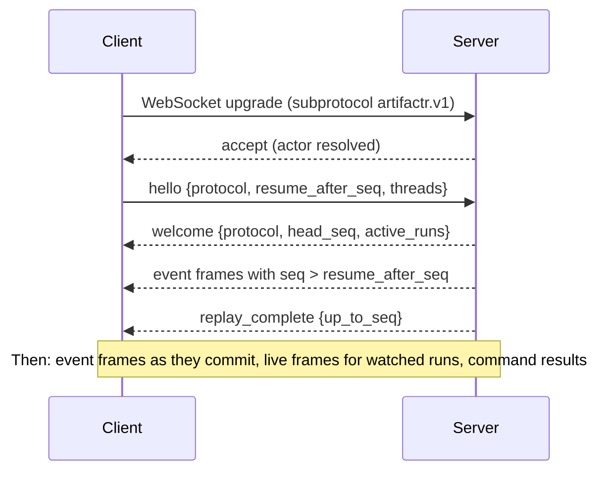

# Thread protocol v1

> **Status:** v1, implemented by `artifactr.fastapi` and `artifactr.mcp`, with its JSON Schema in `schemas/artifactr.v1.json`. Its structure is settled by [ADR-0005](adr/0005-one-event-log-per-workspace.md), [ADR-0007](adr/0007-caller-owned-live-output.md), [ADR-0012](adr/0012-surfaces-websocket-rest-mcp.md) and [ADR-0022](adr/0022-surfaces-over-one-command-handler.md). Field names may still change before the first release; after it, v1 changes only additively (see [Versioning and schema](#versioning-and-schema)).

Clients connect to a workspace over WebSocket. They receive the workspace's durable events with resume, send commands, and receive live frames for runs they are watching. REST exposes the same commands and the same reads.

## Connection

- **Endpoint:** `GET /v1/workspaces/{workspace_id}/stream`, upgraded to WebSocket with subprotocol `artifactr.v1`.
- **Authentication** is resolved by the host application before the socket is accepted. The host supplies `resolve_actor(request) -> (tenant_id, Actor)`; failure closes the socket with `4401`.
- **Frames** are UTF-8 JSON text frames, one message per frame.
- **One reader per socket.** The server reads inbound frames in a single loop and never awaits long work in it. Commands are dispatched as tasks, so a `stop_run` is never stuck behind a slow command.

## Handshake and resume



```json
{"type": "hello", "protocol": "artifactr.v1", "resume_after_seq": 1041, "threads": ["thr_9"]}
```

```json
{
  "type": "welcome",
  "protocol": "artifactr.v1",
  "workspace_id": "ws_1",
  "head_seq": 1057,
  "reset": false,
  "active_runs": [{"run_id": "run_42", "thread_id": "thr_9"}]
}
```

- **The server owns the protocol version.** An unsupported `protocol` closes the socket with `4400`.
- **Resume is by `seq`, never by timestamp.** The server subscribes to the log from `resume_after_seq` before replaying, so no event can fall between replay and live delivery.
- `resume_after_seq` of `0` replays from the beginning of retained history. If the client has seen events this log does not have (its position is past `head_seq`, for example after the server's data was reset), or the position is older than retention, `welcome` carries `reset: true`: the client discards what it holds and rebuilds from the replay. The decision is `artifactr.core.resume`.
- `threads` filters thread-scoped events (messages, runs). Workspace-scoped events (artifacts, proposals) are always delivered.
- A `hello` not received within the server's timeout closes the socket with `4408`.

## Server frames

### `event`: durable

Every durable event arrives in the same envelope. The stored envelope and the wire frame have the same shape; the models are `Envelope` and `Event` in `artifactr.core`.

```json
{
  "type": "event",
  "seq": 1042,
  "id": "6f1c0f7e-3b0e-4a8a-9d7b-1a2b3c4d5e6f",
  "ts": "2026-09-28T14:03:11.204Z",
  "workspace_id": "ws_1",
  "thread_id": "thr_9",
  "run_id": "run_42",
  "actor": {"kind": "agent", "thread_id": "thr_9", "run_id": "run_42", "name": "assistant"},
  "event": {
    "type": "artifact_changed",
    "artifact_id": "plan_1",
    "kind": "plan",
    "version": 8,
    "patch": {"kind": "json_patch", "ops": [{"op": "replace", "path": "/tasks/t3/status", "value": "done"}]},
    "summary": "completed Ship v1",
    "proposal_id": null,
    "thread_id": "thr_9",
    "run_id": "run_42"
  }
}
```

`actor.kind` is one of `user` (`id`, `name?`), `agent` (`thread_id`, `run_id?`, `name`), `external_agent` (`client_id`, `name?`), `system` (`name`) or `evaluator` (`name`, `version`). Every event of one thread's agent is the same participant, whatever its run.

| `event.type` | Scope | Fields |
|---|---|---|
| `thread_created` | thread | `thread_id`, `title` |
| `thread_mode_changed` | thread | `thread_id`, `mode` (`edit`, `suggest`) |
| `focus_changed` | thread | `thread_id`, `artifact_ids` |
| `message_posted` | thread | `thread_id`, `message_id`, `content`, `run_id?`. The author is the envelope's actor. |
| `artifact_created` | workspace | `artifact_id`, `kind`, `version`, `data`, `proposal_id?` |
| `artifact_changed` | workspace | `artifact_id`, `kind`, `version`, `patch`, `summary`, `proposal_id?` |
| `artifact_archived` | workspace | `artifact_id`, `kind`, `version`, `proposal_id?` |
| `proposal_created` | workspace | `proposal_id`, `change` (the proposed `create_artifact`, `edit_artifact` or `archive_artifact` command; a proposed edit always carries a `summary`, generated when the proposer gave none), `rationale?` |
| `proposal_resolved` | workspace | `proposal_id`, `decision` (`accept`, `reject`), `proposed_by`, `artifact_id`, `changes?`, `reason?`, `version?` |
| `run_started` | run | `run_id`, `thread_id`, `trigger` (`message`, `resume`, `api`), `trace_id?`: the OpenTelemetry trace of this attempt, when it is traced |
| `tool_called` | run | `run_id`, `thread_id`, `tool_call_id`, `tool_name`, `args_summary` |
| `tool_returned` | run | `run_id`, `thread_id`, `tool_call_id`, `tool_name`, `status` (`ok`, `error`, `retry`), `summary` |
| `run_paused` | run | `run_id`, `thread_id`, `requests`: list of `{tool_call_id, tool_name, kind: question \| approval, args}`, `usage?` |
| `deferred_answered` | run | `run_id`, `thread_id`, `tool_call_id`, `answer?`, `approved?` |
| `run_ended` | run | `run_id`, `thread_id`, `status` (`completed`, `stopped`, `failed`), `usage?`, `error?`, `reason?`: a failure's typed reason, such as `guardrail_blocked` |
| `feedback_given` | thread, or workspace for an artifact | `feedback_type`, `target` (`{kind: artifact, artifact_id, version}`, `{kind: thread, thread_id}`, `{kind: turn, run_id}` or `{kind: message, message_id, thread_id, run_id?}`), `value` (the feedback type's fields, validated), `thread_id?`, `run_id?`. The judge is the envelope's actor. |
| `app_event` | any | `name`, `data`, `thread_id?`, `run_id?` |

Artifact and proposal events are workspace-scoped, and also carry the `thread_id` and `run_id` they originated in, when there is one.

A `patch` is one of:

- `{"kind": "json_patch", "ops": [...]}`: RFC 6902 operations over the artifact's JSON data.
- `{"kind": "text_edits", "field": "text", "edits": [{"old": "...", "new": "..."}]}`: anchored replacements in one text field, where each `old` occurs exactly once when applied. An empty `old` writes into an empty field.

### `live`: ephemeral

Live frames carry a run's token-level output. They have no `seq`, are not stored, and delivery is best-effort: a watcher that falls behind loses its oldest frames. Within one run they arrive in order. The models are `LiveFrame` and `LiveEvent` in `artifactr.core`.

```json
{"type": "live", "run_id": "run_42", "event": {"type": "text_delta", "part": 0, "delta": "Here is the"}}
```

| `event.type` | Fields | Source |
|---|---|---|
| `part_started` | `part`, `part_kind` (`text`, `thinking`, `tool_call`), `tool_name?` | pydantic-ai `PartStartEvent` |
| `text_delta` | `part`, `delta` | `PartDeltaEvent` |
| `thinking_delta` | `part`, `delta` | `PartDeltaEvent` |
| `tool_args_delta` | `part`, `delta` | `PartDeltaEvent` |
| `part_ended` | `part` | `PartEndEvent` |
| `draft` | `artifact_id?`, `kind`, `data` | an application tool's `ctx.emit(ArtifactDraft(...))`: a full snapshot of an artifact being generated, not yet committed |
| `app_live` | `name`, `data` | other application `CustomEvent`s; `data` holds the event's own fields |

Durable events supersede live frames. When the agent's `message_posted` arrives, it is the authoritative text for that message. When `artifact_changed` arrives, it replaces any `draft` for that artifact.

Clients receive live frames for runs in the threads they subscribed to. `watch_run` attaches to a specific run.

### `command_result`

Every command gets exactly one result.

```json
{"type": "command_result", "command_id": "c_17", "ok": true, "outcome": {"type": "applied", "artifact_id": "plan_1", "version": 9, "seq": 1043}}
```

```json
{
  "type": "command_result",
  "command_id": "c_18",
  "ok": false,
  "rejection": {"type": "version_conflict", "message": "artifact plan_1 is at version 8, but the change was based on 7", "artifact_id": "plan_1", "base": 7, "head": 8}
}
```

`outcome.type` is `applied` (`artifact_id`, `version`), `proposed` (`proposal_id`), `resolved` (`proposal_id`, `decision`, `version?`) or `recorded`. `rejection.type` is one of `version_conflict`, `validation_failed`, `patch_failed`, `not_found`, `forbidden` or `invalid_state`; every rejection has a `message` and its typed details.

### `replay_complete`

```json
{"type": "replay_complete", "up_to_seq": 1057}
```

Sent once, when replay has reached the `head_seq` announced in `welcome`, even if the last replayed events belonged to threads the client does not follow. Every later `event` frame is live.

v0.1 retains the whole log, so a `reset` is followed by a full replay. Snapshots for resuming beyond retention are an [open question](architecture.md#open-questions).

### `error`

```json
{"type": "error", "message": "not a command frame: Input should be a valid dictionary"}
```

A frame the server could not parse, or a command that failed unexpectedly on the server. Rejections are not errors: they arrive as `command_result` frames with `ok: false`.

## Client frames: commands

After `hello`, a client sends command frames. Each wraps one command with a client-chosen `command_id`, which correlates it with its `command_result` and is also an idempotency key: the server remembers recent ids (per process) and answers a repeated id with the original result instead of running the command again.

```json
{"type": "command", "command_id": "c_17", "command": {"type": "post_message", "thread_id": "thr_9", "content": "Draft the plan"}}
```

The command is one of the `Command` models in `artifactr.core`, or `stop_run` or `watch_run`. Ids of anything a command creates (`artifact_id`, `thread_id`, `message_id`, `proposal_id`) may be chosen by the client; they are generated when omitted. A frame that is not a valid command frame gets an `error` frame in reply, and the connection stays open.

| `type` | Fields | Effect |
|---|---|---|
| `create_thread` | `thread_id?`, `title?` | `thread_created` |
| `post_message` | `thread_id`, `content`, `message_id?` | `message_posted`. Starts a run if the thread is idle, steers the running run if there is one, and answers a paused run's pending requests (declining approvals, with the message as the reason) before resuming it. |
| `set_focus` | `thread_id`, `artifact_ids` | `focus_changed` |
| `set_thread_mode` | `thread_id`, `mode` (`edit`, `suggest`) | `thread_mode_changed` |
| `create_artifact` | `kind`, `data`, `artifact_id?`, `thread_id?`, `proposal_id?` | `artifact_created`, or `proposal_created` under the type's write policy |
| `edit_artifact` | `artifact_id`, `base_version`, `patch`, `summary?`, `thread_id?`, `proposal_id?` | `artifact_changed`, or `proposal_created` under the type's write policy |
| `archive_artifact` | `artifact_id`, `base_version`, `thread_id?`, `proposal_id?` | `artifact_archived`, or `proposal_created` under the type's write policy |
| `propose_change` | `change` (a `create_artifact`, `edit_artifact` or `archive_artifact` command), `rationale?`, `proposal_id?` | `proposal_created`, whatever the write policy |
| `respond_to_proposal` | `proposal_id`, `decision` (`accept`, `reject`), `changes?`, `reason?` | `proposal_resolved`, plus the artifact event when accepted. Accepted with `changes`, the edit's summary describes what was applied. |
| `answer_deferred` | `run_id`, `tool_call_id`, `answer` or `approved` | `deferred_answered`. Once every pending request is answered, the paused run resumes. |
| `give_feedback` | `feedback_type`, `target`, `value` | `feedback_given`. The type must be registered and declare the target's kind, the value must validate against it, and the target must exist: an artifact at that version or later, a thread, a run, or a message's thread (and run, if given, in that thread). An `evaluator` actor may only give feedback. |
| `stop_run` | `run_id` | Cancels a run of this workspace that is running in the serving process; `run_ended` with status `stopped`. |
| `watch_run` | `run_id` | Attaches this socket to the run's live frames, starting with what the run has produced so far. WebSocket only. |

```json
{
  "type": "command",
  "command_id": "c_18",
  "command": {
    "type": "edit_artifact",
    "artifact_id": "plan_1",
    "base_version": 7,
    "patch": {"kind": "json_patch", "ops": [{"op": "add", "path": "/tasks/t9", "value": {"title": "Write changelog"}}]}
  }
}
```

Every command is carried out by `artifactr.agent.Runner.execute`, whichever transport it arrives on, so it behaves identically everywhere.

## Close codes

| Code | Meaning | Client action |
|---|---|---|
| `1000` | Normal closure | none |
| `1001` | Server going away | reconnect and resume |
| `4400` | The first frame was not a valid `hello`, or asked for an unsupported protocol version | fix or upgrade the client |
| `4401` | Unauthenticated | re-authenticate |
| `4403` | Actor may not access this workspace | stop |
| `4408` | `hello` not received in time | reconnect |
| `4429` | The client did not read frames fast enough and its outbox overflowed | reconnect and resume |

## REST

REST mirrors the commands and exposes reads; `artifactr.fastapi.artifactr_router` serves both. Command bodies are the same `command` frames as over the WebSocket.

| Method and path | Purpose |
|---|---|
| `POST /v1/workspaces/{workspace_id}/commands` | Submit one command frame; the response body is its `command_result`. |
| `GET /v1/workspaces/{workspace_id}/artifacts?kind=&include_archived=` | List artifacts. |
| `GET /v1/workspaces/{workspace_id}/artifacts/{artifact_id}` | The current `Versioned` artifact: `id`, `kind`, `version`, `data`, `updated_by`, `archived`. |
| `GET /v1/workspaces/{workspace_id}/artifacts/{artifact_id}/revisions` | Revision history. Each revision has the `trace_id` it was committed in, when it was traced. |
| `GET /v1/workspaces/{workspace_id}/events?after_seq=&thread_id=&limit=` | A page of the log, as envelopes. `thread_id` may repeat. |
| `GET /v1/workspaces/{workspace_id}/threads` | Every thread. |
| `GET /v1/workspaces/{workspace_id}/threads/{thread_id}` | A thread's mode and focus. |
| `GET /v1/workspaces/{workspace_id}/proposals?status=` | Proposals, pending by default. |
| `GET /v1/workspaces/{workspace_id}/runs/{run_id}` | A run, with any requests it is paused on. |

Authentication is the host's: `resolve_actor(request)` returns the tenant and actor, or raises `Unauthorized` (401). An optional `authorize(tenant, workspace, actor)` refuses with 403.

Rejections map to HTTP status codes (`artifactr.fastapi.STATUS_CODES`): `version_conflict` and `invalid_state` → 409, `validation_failed` and `patch_failed` → 422, `not_found` → 404, `forbidden` → 403. `watch_run` over REST is rejected as `invalid_state`.

## MCP mapping

External agents connect over MCP (`artifactr.mcp.ArtifactrMcp`) with the same authority as any other actor. The host's `resolve(ctx)` returns the client's tenant and `ExternalAgentActor`, and every tool goes through the same workspace rules and `Runner`.

| MCP | artifactr |
|---|---|
| Resource template `artifactr://{tenant_id}/{workspace_id}/artifacts/{artifact_id}` | The artifact's current `Versioned` JSON. Only readable by clients of that tenant. |
| `subscriptions/listen` and resource-updated notifications | Published for `artifact_created`, `artifact_changed` and `artifact_archived` in every workspace a client has used, through the server's `SubscriptionBus`. |
| Tools `list_artifacts`, `read_artifact`, `create_artifact`, `edit_text`, `edit_artifact`, `archive_artifact` | Artifact commands. The edit tools take an optional `base_version` (required for `edit_artifact`) and `propose` with `rationale`. |
| Tools `list_proposals`, `respond_to_proposal` | Review others' proposals. |
| Tool `post_message` | A message in a thread, handled like any other: it starts, steers or answers the thread's agent. |
| Tool `give_feedback` | Feedback of an application's type on an artifact version, a thread, a turn or a message. |

Rejections are returned as tool errors carrying the rejection's message.

## Versioning and schema

- The protocol identifier is `artifactr.v1`, also accepted as the WebSocket subprotocol. Within v1, changes are additive only: new optional fields and new event types. Clients must ignore unknown fields and keep unknown event types as opaque envelopes, since they still carry a `seq`.
- Breaking changes get a new subprotocol, `artifactr.v2`, served alongside v1 during migration.
- The JSON Schema for every frame is generated from the Pydantic models (`TypeAdapter(...).json_schema()`) into `schemas/artifactr.v1.json` and checked in. CI fails if it drifts. Clients generate their types from it, for example with `json-schema-to-typescript`.
