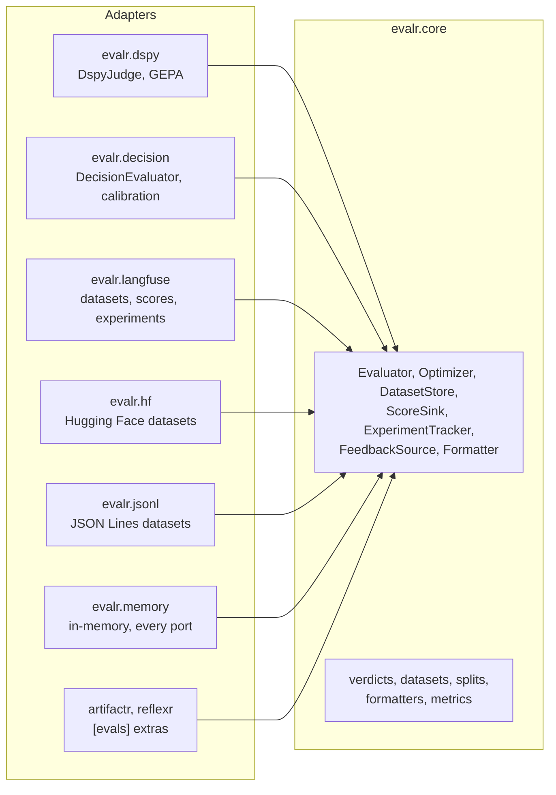

# Architecture

> **Status:** accepted design, being built in the phases tracked by [RFC-0001](rfcs/0001-v0.1-implementation-plan.md). This document is evergreen: it is updated in the same pull request as the code that changes it, and the table below shows what exists today. Decisions are recorded in [`adr/`](adr/README.md), and proposals in [`rfcs/`](rfcs/README.md).

| Package | Status |
|---|---|
| `evalr.core` | Verdicts, field kinds, the evaluator protocol, function evaluators, datasets, splits and formatters implemented; the other ports and the metrics planned (phase 1) |
| `evalr.memory`, `evalr.contracts`, `evalr.jsonl` | Dataset stores and feedback sources implemented; the other ports planned (phase 1) |
| `evalr.dspy` | Planned (phase 2) |
| `evalr.decision` | Planned (phase 3) |
| `evalr.langfuse`, `evalr.hf` | Planned (phase 4) |
| End-to-end measures and online helpers | Planned (phase 5) |

## What evalr is

evalr is a Python library for **typed evaluation of agent systems**. An evaluator judges an input (a chat thread, a workflow run, an artifact version) and returns a verdict: an instance of a Pydantic type, typically one of the feedback types people also give. Because people and evaluators produce the same types, evaluators can be trained on people's feedback and measured against it.

It serves [artifactr](https://github.com/alexnodeland/artifactr) and [reflexr](https://github.com/alexnodeland/reflexr), which record typed feedback from people and depend on evalr through their `[evals]` extras. evalr imports neither ([ADR-0001](adr/0001-typed-verdicts-over-any-pydantic-model.md)).

### Goals

- Verdicts are typed. A verdict type is any Pydantic model, and its field types decide how each field is judged and scored.
- Two kinds of evaluator are equals ([ADR-0002](adr/0002-dspy-judges-and-decision-models-as-equals.md)): DSPy judges optimized with GEPA, and decision models (TypeSafe's Jev) with a language-model fallback. Both implement one protocol and are measured with the same metrics.
- Evaluators are versioned, and the version is recorded on every verdict, so scores from different evaluators never mix.
- Datasets and experiments are reproducible: deterministic splits, deterministic dataset item ids, pinned revisions ([ADR-0003](adr/0003-datasets-and-experiments-in-langfuse-and-hugging-face.md)).
- The core is small and pure. Every integration is an adapter behind one of its ports, and behind an extra.

### Non-goals (for now)

- A hosted evaluation service or a UI. Langfuse shows experiments and scores; Hugging Face hosts published datasets.
- Evaluators for every modality. Inputs are Pydantic models turned into text.

## Ports and adapters

evalr is built as ports and adapters ([ADR-0006](adr/0006-ports-and-adapters.md)). `evalr.core` is the hexagon: the values (verdicts, examples, datasets, scores, experiment results), the pure functions over them, and the **ports**, small protocols for what the core needs from outside. **Adapters** implement the ports, each in its own package, and depend inward only.



| Port | What it does | Adapters |
|---|---|---|
| `Evaluator[InputT, VerdictT]` | Judges an input and returns a typed verdict | `FunctionEvaluator` (core), `DspyJudge` (`evalr.dspy`), `DecisionEvaluator` (`evalr.decision`); compositions: `Fallback` (core), sampling and budgets (phase 5) |
| `Optimizer[InputT, VerdictT, EvaluatorT]` | Fits an evaluator to people's verdicts | GEPA (`evalr.dspy`), threshold calibration (`evalr.decision`), in-memory (`evalr.memory`) |
| `DatasetStore` | Saves a dataset and returns its revision; loads one by name and revision | `evalr.memory`, `evalr.jsonl`, `evalr.langfuse`, `evalr.hf` |
| `ScoreSink` | Records verdicts as scores, idempotently | `evalr.memory`, `evalr.langfuse`, OpenTelemetry evaluation events (phase 5) |
| `ExperimentTracker` | Runs a task over a dataset and judges each output | `evalr.memory`, `evalr.langfuse` |
| `FeedbackSource[InputT, VerdictT]` | Yields examples from people's typed feedback | `evalr.memory`; artifactr's and reflexr's `[evals]` extras |
| `Formatter[InputT]` | Renders an input as text within a token budget | `InputFormatter` (core) |

- **Compositions, not special cases.** A decision evaluator that hands unsure inputs to a language-model judge is `Fallback(DecisionEvaluator(...), DspyJudge(...))`.
- **I/O ports are async.** Adapters over synchronous SDKs run them in a worker thread.
- **Every port has an in-memory adapter** in `evalr.memory`, and a contract suite in `evalr.contracts` that the in-memory adapter and every other adapter pass. The libraries run the `FeedbackSource` suite against their own adapters.

| Package | Extra | May import |
|---|---|---|
| `evalr.core` | | pydantic, opentelemetry-api |
| `evalr.memory`, `evalr.contracts`, `evalr.jsonl` | | core |
| `evalr.dspy` | `[dspy]` | core, dspy |
| `evalr.decision` | `[jev]` | core, pydantic-ai-slim with the typesafe extra |
| `evalr.langfuse` | `[langfuse]` | core, langfuse |
| `evalr.hf` | `[hf]` | core, datasets, huggingface_hub |

A test enforces the table: what each package imports, that no adapter package imports another, and that nothing imports artifactr or reflexr. The `[all]` extra installs every integration.

## Verdicts

A verdict type is any Pydantic model: an application's feedback type, a library's `Feedback` subclass, or an ad-hoc model. evalr needs nothing from the libraries ([ADR-0001](adr/0001-typed-verdicts-over-any-pydantic-model.md)).

```python
class Helpfulness(BaseModel):
    rating: Annotated[int, Field(ge=1, le=5, description="How much the reply helped")]
    resolved: bool = Field(description="The request was fully addressed")
    category: Literal["billing", "bug", "other"]
    reason: str | None = None
```

`verdict_fields(Helpfulness)` describes how each field is judged and scored. It is the one place that reads field types, and every evaluator kind, metric and integration builds on it:

| Field type | Kind | Filled by | Agreement |
|---|---|---|---|
| `bool` | binary | any evaluator | accuracy, Cohen's kappa |
| `Literal`, `Enum` | categorical | any evaluator | accuracy, Cohen's kappa |
| `int` bounded on both sides | ordinal | any evaluator | mean absolute error, Spearman |
| any other `int` or `float` | numeric | any evaluator | mean absolute error, Spearman |
| `str` | text | language-model judges only | not scored |

- `X | None` is judged as `X` and may be left empty. Bounds are read from `Field(ge=, le=, gt=, lt=)` and `annotated_types` constraints at any level of `Annotated`, including inside an optional. An integer's exclusive bounds become inclusive (`gt=0` is 1).
- A field's description is the instruction judges read for it.
- Any other type (a list, a nested model, a union of several types) raises `UnsupportedField` when an evaluator is built, rather than failing later.

An evaluator returns a `Verdict[V]`, an immutable Pydantic model:

| Field | Meaning |
|---|---|
| `value` | The verdict type's instance |
| `confidence` | The probability that each field's value is right, from 0 to 1, for the fields the evaluator has one for. Decision models report them; most judges do not. Keys must be fields of the verdict type. |
| `evaluator`, `version` | Who judged. A changed evaluator changes its version, so verdicts from before and after never mix. |
| `latency` | Wall-clock seconds the evaluation took |
| `cost` | US dollars, when known |
| `trace_id` | The OpenTelemetry trace the evaluation ran in, as 32 hex digits, when there was one |

## Evaluators

`Evaluator[InputT, VerdictT]` is a protocol: a `name`, a `version`, a `verdict_type`, and `async evaluate(input) -> Verdict[VerdictT]`. Inputs are Pydantic models too. The protocol is contravariant in the input and covariant in the verdict, so evaluators of different verdict types fit one `list[Evaluator[Thread, BaseModel]]`.

| Kind | How | Version |
|---|---|---|
| `FunctionEvaluator` | A sync or async function of the input: a deterministic measure | Given; bump it when the function changes |
| `DspyJudge` (phase 2) | A DSPy module whose signature comes from the input and verdict types | A hash of the compiled program |
| `DecisionEvaluator` (phase 3) | A pydantic-ai agent on a decision model, with a language-model fallback | The decision model's id and its thresholds |

## Datasets

An `Example[InputT, VerdictT]` is one input with what is known about it:

- `id`: stable for life, derived from the feedback or item it came from. Splits are hashed from it, and syncing uses it.
- `input`: what an evaluator judges.
- `verdict`: the verdict people gave, when there is one. Judges are trained and measured against it.
- `reference`: a reference output for the system being evaluated, as JSON, for evaluators that compare against one.
- `trace_id`: the trace the input came from, so datasets and experiments link back to it.
- `metadata`: anything else, as JSON.

A `Dataset[InputT, VerdictT]` is an immutable, named collection of examples with unique ids, and the input and verdict types they share.

- `version` is a hash of the examples' content, independent of their order. A trained judge records the version it was trained on.
- `split(validate=0.2, salt="")` sends an example to validation when `split_bucket(id, salt) < validate`, where the bucket is the first eight bytes of `sha256(salt, id)` as a fraction. So an example never moves between training and validation as others are added or removed, and raising the fraction only moves examples into validation. A different salt gives an independent split.
- `labelled()` and `filter(predicate)` select examples. `records()` and `Dataset.from_records(...)` convert to and from JSON records, which the Langfuse and Hugging Face integrations build on.

### Stores and sources

A `DatasetStore` saves a dataset under its name and returns the revision it made; `load(name, input_type=, verdict_type=, revision=None)` loads the latest revision or the one given, validating the examples as the types given, and raises `DatasetNotFound` for an unknown name or revision. Every revision stays loadable after later saves, so an experiment or a trained judge can name the exact data it used, and saving the same content again changes nothing a load can see.

| Adapter | Revision | Notes |
|---|---|---|
| `InMemoryDatasetStore` (`evalr.memory`) | The content hash | JSON records in memory, validated again on load |
| `JsonlDatasetStore(root)` (`evalr.jsonl`) | The content hash | A directory per dataset: `dataset.json` names the latest revision and holds the description; each revision is `{hash}.jsonl`, one example to a line, written whole. Names are `/`-separated segments of letters, digits, `.`, `_` and `-`, so they stay under the root. |
| Langfuse, Hugging Face (phase 4) | | |

A `FeedbackSource[InputT, VerdictT]` yields examples from people's feedback: every example has a verdict, ids are stable, and iterating again yields the same examples. artifactr's and reflexr's `[evals]` extras implement it over their logs; `InMemoryFeedbackSource` holds a fixed list. `collect(name, source)` gathers one into a dataset.

### Contract suites

`evalr.contracts` holds a check per port, which raises `ContractViolation` where an adapter differs from the port's contract. The checks need no test framework, so the libraries run `check_feedback_source` against their own adapters.

- `check_dataset_store(store)`: an unknown name is not found; a saved dataset loads back exactly (name, examples, description); saving again changes nothing; a changed dataset makes a new revision and the earlier one still loads; an unknown revision is not found; loading as a type the examples do not satisfy fails validation.
- `check_feedback_source(source)`: ids are unique, inputs and verdicts are of the source's types, every example has a verdict, and iterating again yields the same examples.

## Formatters

A formatter renders an input as the text a judge reads. A decision model's state is limited (Jev's to 32K tokens), and a language model's context costs money, so formatters work within a budget.

- `InputFormatter(max_tokens=30_000, count_tokens=estimate_tokens)` renders each field as a section headed by its name and description: strings as they are, lists one item to a line, anything else as JSON. `fields(input)` renders the fields separately, for judges that read them one by one.
- Over budget, the longest list loses its oldest items, after the first (usually the request), with a marker saying how many were omitted. Then the longest remaining text is shortened in the middle. The result always fits.
- `estimate_tokens` counts one token per three bytes of UTF-8, which overestimates English and is close for scripts of three bytes a character, so a budget measured with it is rarely exceeded. Where the limit is exact, pass the model's tokenizer as `count_tokens`.
- Summarizing, rather than windowing, is a formatter too: any callable from the input to text fits the `Formatter` protocol.

## Observability

evalr uses the OpenTelemetry API only, under the `evalr` scope, and never configures the SDK. Evaluators take an optional `tracer_provider`, defaulting to the global one.

- Every evaluation runs in a span named `evalr.evaluate {evaluator}`, with the attributes `evalr.evaluator.name`, `evalr.evaluator.version` and `evalr.verdict.type`. The span is current while the evaluator works, so the spans of the language models or agents it calls nest under it. A failure is recorded on the span.
- The verdict's `trace_id` is that span's trace, so a verdict made inside an experiment item's trace, or on the trace of the run it judges, links back to it. With no SDK configured, and no enclosing trace, it is `None`.
- `judging(tracer, evaluator=, version=, verdict_type=)` is the context manager every evaluator kind uses; application evaluators can use it too.

## Quality

The gates are those of artifactr and reflexr ([ADR-0005](adr/0005-quality-gates-and-license.md)): pyright strict with no suppressions, 100% line and branch coverage, warnings as errors, and no network in tests. Jev is tested through the TypeSafe SDK's transport, DSPy with its dummy language model, Langfuse with fakes and an in-memory span exporter, and Hugging Face with local datasets.
