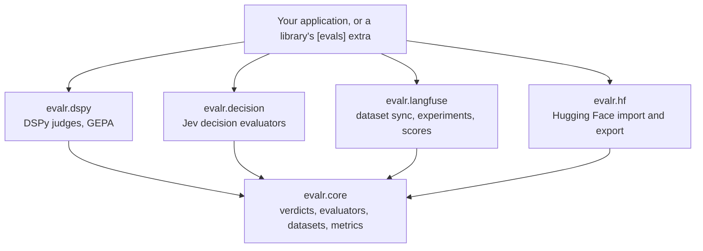

# Architecture

> **Status:** accepted design, being built in the phases tracked by [RFC-0001](rfcs/0001-v0.1-implementation-plan.md). This document is evergreen: it is updated in the same pull request as the code that changes it, and the table below shows what exists today. Decisions are recorded in [`adr/`](adr/README.md), and proposals in [`rfcs/`](rfcs/README.md).

| Package | Status |
|---|---|
| `evalr.core` | Planned (phase 1) |
| `evalr.dspy` | Planned (phase 2) |
| `evalr.decision` | Planned (phase 3) |
| `evalr.langfuse`, `evalr.hf` | Planned (phase 4) |
| End-to-end measures and online helpers | Planned (phase 5) |

## What evalr is

evalr is a Python library for **typed evaluation of agent systems**. An evaluator judges an input (a chat thread, a workflow run, an artifact version) and returns a verdict: an instance of a Pydantic type, typically one of the feedback types people also give. Because people and evaluators produce the same types, evaluators can be trained on people's feedback and measured against it.

It serves [artifactr](https://github.com/alexnodeland/artifactr) and [reflexr](https://github.com/alexnodeland/reflexr), which record typed feedback from people and depend on evalr through their `[evals]` extras. evalr imports neither ([ADR-0001](adr/0001-typed-verdicts-over-any-pydantic-model.md)).

### Goals

- Verdicts are typed. A verdict type is any Pydantic model, and its field types decide how each field is judged and scored.
- Two kinds of evaluator are equals ([ADR-0002](adr/0002-dspy-judges-and-decision-models-as-equals.md)): DSPy judges optimized with GEPA, and decision models (TypeSafe's Jev) with a language-model fallback. Both implement one protocol and are measured with the same metrics.
- Evaluators are versioned, and the version is recorded on every verdict, so scores from different evaluators never mix.
- Datasets and experiments are reproducible: deterministic splits, deterministic dataset item ids, pinned revisions ([ADR-0003](adr/0003-datasets-and-experiments-in-langfuse-and-hugging-face.md)).
- The core is small and pure, with every integration behind an extra.

### Non-goals (for now)

- A hosted evaluation service or a UI. Langfuse shows experiments and scores; Hugging Face hosts published datasets.
- Evaluators for every modality. Inputs are Pydantic models turned into text.

## Layers

Dependencies point one way. Each package is usable without the others, and a test enforces the imports.

| Package | Depends on | Responsibility |
|---|---|---|
| `evalr.core` | pydantic, opentelemetry-api | Verdicts, the evaluator protocol, datasets and splits, formatters, agreement and calibration metrics, function evaluators. Pure. |
| `evalr.dspy` (`[dspy]`) | core, dspy | `DspyJudge`, signature derivation, `optimize` with GEPA, versioned judges |
| `evalr.decision` (`[jev]`) | core, pydantic-ai-slim with the typesafe extra | `DecisionEvaluator`, the language-model fallback, threshold calibration |
| `evalr.langfuse` (`[langfuse]`) | core, langfuse | Dataset sync, experiments, scores |
| `evalr.hf` (`[hf]`) | core, datasets | Hugging Face import and export |

The `[all]` extra installs every integration.

## Quality

The gates are those of artifactr and reflexr ([ADR-0005](adr/0005-quality-gates-and-license.md)): pyright strict with no suppressions, 100% line and branch coverage, warnings as errors, and no network in tests. Jev is tested through the TypeSafe SDK's transport, DSPy with its dummy language model, Langfuse with fakes and an in-memory span exporter, and Hugging Face with local datasets.
