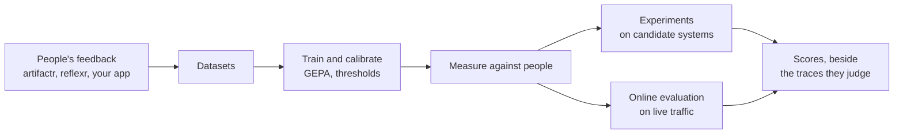
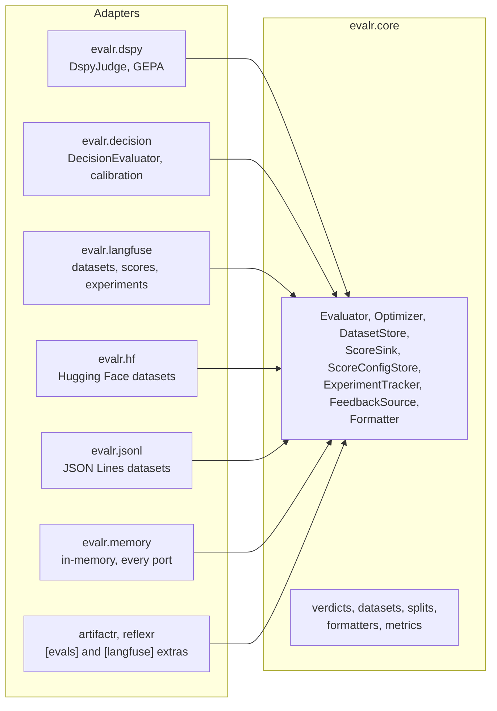

# Concepts

evalr has a handful of ideas, and every part of the library is one of them. This page introduces each, and links to the guide that covers it in depth.

## The loop

People judge an agent's work with typed feedback. evalr turns that feedback into datasets, fits evaluators to it, measures how far they agree with people, and then lets them judge where people cannot: every candidate system in an experiment, and a sample of live traffic.

## Verdicts

A **verdict type** is any Pydantic model, typically the feedback type people give, such as a `Helpfulness` with a rating, a yes-or-no and a reason. Because people and evaluators give the same types, an evaluator predicts exactly what a person would have said, and the two are compared field by field.

The type of each field is its **kind**, and the kind decides how the field is judged, measured and scored: `bool` is binary, `Literal` and `Enum` are categorical, an `int` bounded on both sides is ordinal, other numbers are numeric, and `str` is text, which only language-model judges write.

An evaluator returns a **`Verdict`**: the value, with the confidence in each field where the evaluator has one, the evaluator's name and version, the latency, the cost and the trace it ran in. [Typed verdicts and field kinds](guides/verdicts.md)

## Evaluators

An **evaluator** judges an input (a thread, a run, an artifact version, itself a Pydantic model) and returns a verdict. It has a name and a version, and a changed evaluator has a new version, so verdicts from different evaluators, or different versions of one, never mix.

| Kind | What it is | Strengths |
|---|---|---|
| [`FunctionEvaluator`](guides/function-evaluators.md) | A function of the input | Exact and free: computed measures |
| [`DspyJudge`](guides/dspy-judges.md) | A DSPy program whose signature comes from the input and verdict types | Reasons in free text; trained on people's feedback with GEPA |
| [`DecisionEvaluator`](guides/decision-evaluators.md) | A decision model, such as TypeSafe's Jev, through pydantic-ai | Fast and cheap, with calibrated confidence |
| [`Fallback`](guides/decision-evaluators.md#hand-off-and-fallback) | Two evaluators: the primary judges, and hands off to the fallback | A decision model first, a judge only where it is unsure |

An evaluator that declines an input raises **`HandOff`**. DSPy judges and decision models are equals: they implement one protocol, and are measured with the same metrics ([ADR-0002](adr/0002-dspy-judges-and-decision-models-as-equals.md)).

## Datasets

An **`Example`** is one input with what is known about it: the verdict people gave, a reference output, the trace it came from. Its id is stable for life. A **`Dataset`** is an immutable, named collection of examples, versioned by a hash of their content, and **split** deterministically by a hash of each example's id, so an example never moves between training and validation. [Datasets, splits and stores](guides/datasets.md)

**Feedback sources** yield examples from people's feedback, where it is recorded: reflexr's log today, artifactr's with its planned `[evals]` extra, or your own database. [Feedback sources](guides/feedback-sources.md)

## Fitting and measuring

An **optimizer** fits an evaluator to people's verdicts on a training set, checked on a validation set, and returns a new evaluator with a new version and a record of its training: [GEPA](guides/dspy-judges.md#training-with-gepa) rewrites a DSPy judge's instructions, [threshold calibration](guides/calibration.md) tunes a decision evaluator's thresholds, and `BestOf` picks the best of several evaluators.

**`measure`** judges a dataset's labelled examples and reports **agreement** with people, per field, with the measures that suit each kind, **calibration** of the evaluator's confidence, and latency and cost. [Agreement and calibration metrics](guides/metrics.md)

## Using evaluators

- **Scores.** Every verdict becomes one score per field, named `{type}.{field}`, recorded through a score sink next to the trace it judges. artifactr and reflexr score people's feedback with the same mapping, so the two sit side by side. [Scores and score sinks](guides/scores.md)
- **Experiments.** A task (the system under evaluation) runs on every example of a dataset, and every evaluator judges each output, in memory or in Langfuse. [Experiments](guides/experiments.md)
- **Online evaluation.** Evaluators judge a sample of live traffic, within a budget, in the trace of what they judge. [Online evaluation](guides/online.md)
- **Workflow measures.** Task completion, drop-off and rewrites, defined in terms any application's log can be put in. [Workflow measures](guides/measures.md)

## Ports and adapters

evalr is built as ports and adapters ([ADR-0006](adr/0006-ports-and-adapters.md)). `evalr.core` holds the values (verdicts, examples, datasets, scores, results), the pure functions over them, and the **ports**: small protocols for what the core needs from outside. **Adapters** implement the ports, each in its own package, behind its own extra when it needs a third-party library, and depend only on the core.

| Port | What it does | Adapters |
|---|---|---|
| `Evaluator` | Judges an input and returns a typed verdict | `FunctionEvaluator`, `DspyJudge`, `DecisionEvaluator`; composed by `Fallback` |
| `Optimizer` | Fits an evaluator to people's verdicts | `Gepa`, `ThresholdCalibration`, `BestOf` |
| `DatasetStore` | Saves a dataset and returns its revision; loads one by name and revision | In memory, JSON Lines files, Langfuse, the Hugging Face Hub |
| `FeedbackSource` | Yields examples from people's typed feedback | In memory; reflexr's `LogFeedbackSource` |
| `ScoreSink` | Records verdicts and feedback as scores, idempotently | In memory, Langfuse, OpenTelemetry events; the libraries' Langfuse adapters |
| `ScoreConfigStore` | Keeps score configs, so a backend knows how to read each score | In memory; the libraries' Langfuse adapters |
| `ExperimentTracker` | Runs a task over a dataset and judges each output | In memory, Langfuse |
| `Formatter` | Renders an input as text within a token budget | `InputFormatter` |

Three rules follow from this:

- **Compositions, not special cases.** A decision model backed by a language-model judge is `Fallback(DecisionEvaluator(...), DspyJudge(...))`: two adapters of one port, neither aware of the other.
- **Ports that do I/O are async.** Adapters over synchronous SDKs (Langfuse, the Hugging Face Hub, DSPy's optimizer) run them in a worker thread.
- **Every port has an in-memory adapter and a contract suite.** `evalr.memory` stands in for any backend in tests, and `evalr.contracts` checks that every adapter, evalr's or yours, keeps the port's promises. [Testing with the contracts](guides/testing.md)

The core depends on pydantic and the OpenTelemetry API only. Each integration is an extra, and a test enforces which package may import what, that no adapter imports another, and that nothing in evalr imports artifactr or reflexr:

| Package | Extra | Adds |
|---|---|---|
| `evalr.core`, `evalr.memory`, `evalr.contracts`, `evalr.jsonl`, `evalr.measures`, `evalr.online` | | The core, in-memory adapters, contract suites, JSON Lines datasets, workflow measures and online evaluation |
| `evalr.dspy` | `dspy` | DSPy judges and GEPA |
| `evalr.decision` | `jev` | Decision evaluators and calibration, through pydantic-ai with TypeSafe's SDK |
| `evalr.langfuse` | `langfuse` | Langfuse datasets, scores and experiments |
| `evalr.hf` | `hf` | Hugging Face datasets |

## The family

evalr is one of four projects that share their conventions: typed feedback as Pydantic models, scores named `{type}.{field}`, OpenTelemetry through the API only, ports with in-memory adapters, and the same quality gates.

- [artifactr](https://artifactr.alexnodeland.com): chat applications where people and agents collaborate on shared, versioned artifacts. It records people's feedback on threads, turns, messages and artifact versions.
- [reflexr](https://github.com/alexnodeland/reflexr): rules over event streams that run agents, graphs and functions. It records feedback on runs, firings and causal chains.
- **evalr**: evaluators trained on that feedback and measured against it. The libraries depend on evalr through their `[evals]` extras; evalr imports neither.
- [stackr](https://github.com/alexnodeland/stackr): the infrastructure they run on: LiteLLM, OpenTelemetry, Langfuse and Supabase.
